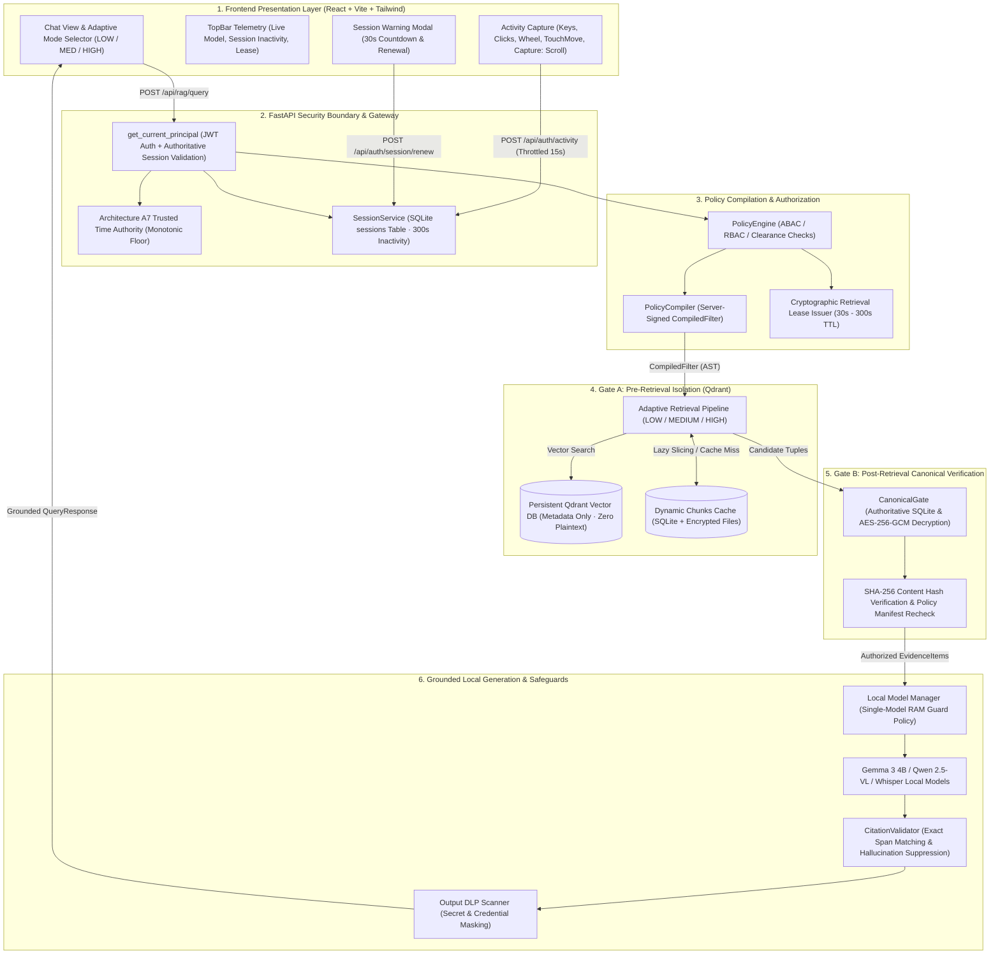
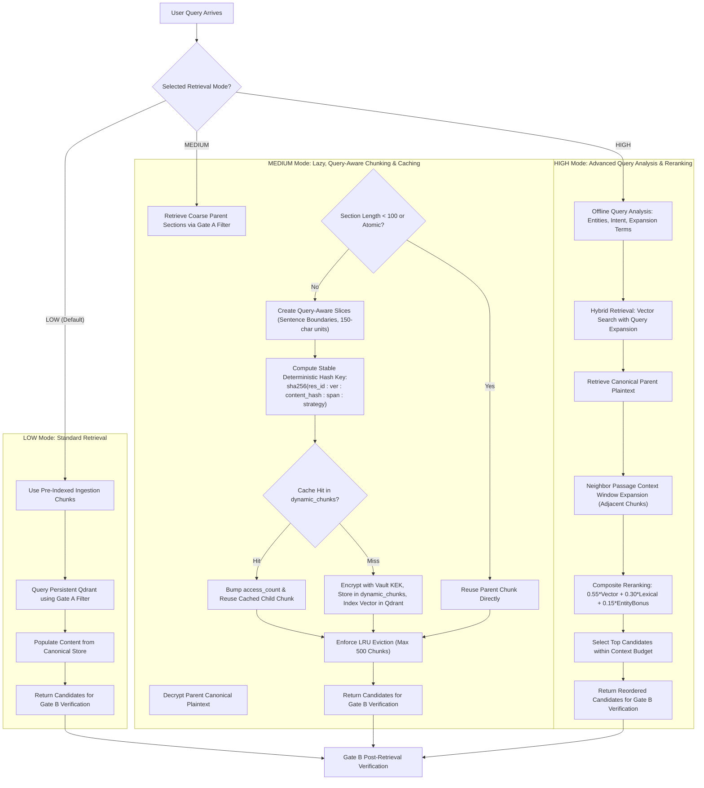
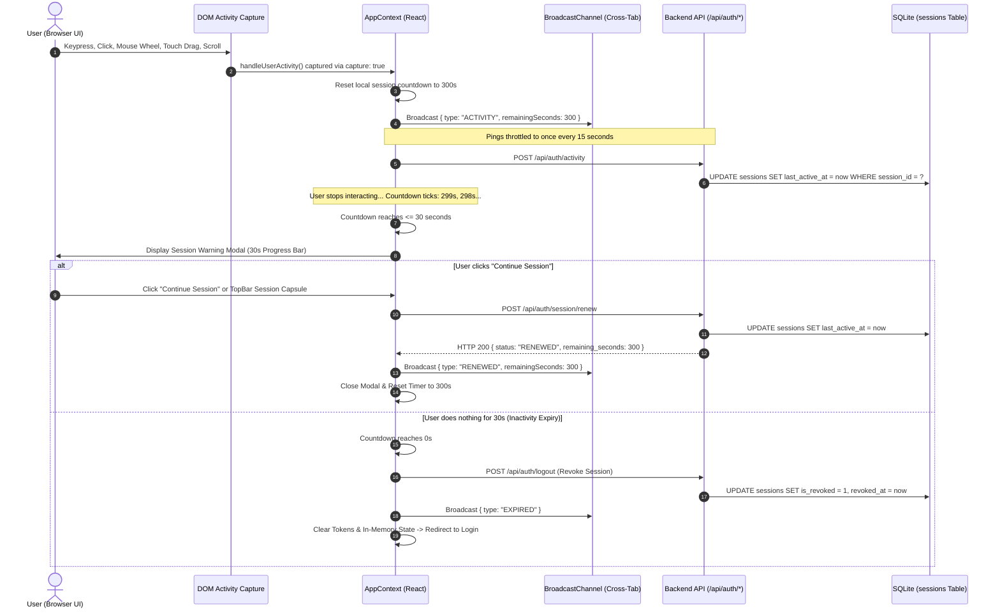
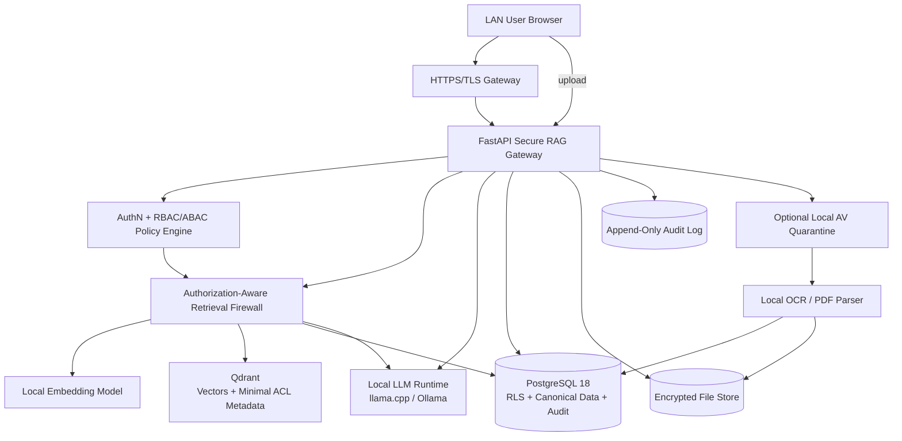

# DARS-RAG: Complete System Architecture & Core Logic Reference

---

## 1. Executive System Overview

**DARS-RAG** (Defense-grade Authorization & Retrieval Security RAG) is an air-gapped, zero-cloud, multi-modal Retrieval-Augmented Generation platform built with strict fail-closed authorization guarantees. It integrates a **Two-Gate Retrieval Firewall**, **Three Adaptive Retrieval Modes (LOW, MEDIUM, HIGH)**, a **Multimodal Dynamic Single-Model RAM Guard**, and an **Authoritative 5-Minute Session Inactivity Management Engine**.



---

## 2. Two-Gate Retrieval Firewall Architecture

DARS-RAG eliminates vector store data leakage and authorization bypass through a strict **Two-Gate Retrieval Firewall**:

```mermaid
sequenceDiagram
    autonumber
    actor User as User / Client
    participant GW as API Gateway (get_current_principal)
    participant PE as Policy Compiler
    participant GateA as Gate A: Vector Store (Qdrant)
    participant Pipe as Adaptive Retrieval Pipeline
    participant GateB as Gate B: Canonical Gate (Disk & SQLite)
    participant LLM as Local LLM & Citation Validator

    User->>GW: Query Request + Mode (LOW | MEDIUM | HIGH)
    GW->>GW: Authoritative Session Validation (fail-closed if >300s inactive)
    GW->>PE: Compile Gate A Filter for Principal + Vault
    PE-->>GW: Server-compiled Signed CompiledFilter

    rect rgb(20, 35, 45)
        note over GW,GateA: Gate A: Pre-Retrieval Vector Isolation
        GW->>Pipe: retrieve(mode, query, CompiledFilter)
        Pipe->>GateA: search(query_vector, CompiledFilter)
        GateA-->>Pipe: Candidate Chunk Metadata (content="")
        Pipe-->>GW: Pre-filtered Candidates
    end

    rect rgb(35, 45, 25)
        note over GW,GateB: Gate B: Post-Retrieval Canonical Verification
        GW->>GateB: verify_and_envelope(Candidates, Principal, Vault, Lease)
        GateB->>GateB: Check Lease Deadline (fail-closed if expired)
        GateB->>GateB: Fetch Resource Manifest from SQL (current policy_version)
        GateB->>GateB: Fetch Encrypted Chunk from Disk & Decrypt with Vault KEK
        GateB->>GateB: SHA-256 Content Hash Integrity Validation
        GateB->>GateB: Point-in-Time Policy Engine Decision (ALLOW / DENY)
        GateB-->>GW: Authorized EvidenceItems with Cryptographic Proof Objects
    end

    GW->>LLM: generate(query, Authorized EvidenceItems)
    LLM->>LLM: Verify Exact Citation Spans (Hallucination Denied)
    LLM-->>User: Grounded Answer + Citations + Security Trace
```



---

## 3. Adaptive Retrieval Modes: LOW, MEDIUM, HIGH



---

## 4. Multimodal Model Manager & Single-Model RAM Guard Policy

```mermaid
stateDiagram-v2
    [*] --> Idle: Application Boot

    state "Single-Model RAM Guard Policy" as RAMGuardPolicy {
        state "Document Modality" as S_Doc {
            GemmaLLM: Gemma 3 4B Active (Document Synthesis & Q&A)
        }
        state "Vision Modality" as S_Vision {
            QwenVL: Qwen 2.5-VL 3B Active (Images & Charts)
        }
        state "Audio Modality" as S_Audio {
            WhisperSTT: Whisper Base Active (Audio Transcription)
        }
        state "Video Modality" as S_Video {
            WhisperQwen: Whisper (Audio) -> Qwen-VL (Frames)
        }
    }

    Idle --> S_Doc: Text / PDF / DOCX Query
    S_Doc --> S_Vision: Image File Upload (PNG, JPG, WEBP)
    note on link
        RAM Guard executes:
        1. Free Gemma 3 4B RAM
        2. Garbage collect GPU/CPU memory
        3. Load Qwen 2.5-VL 3B into memory
    end note

    S_Vision --> S_Audio: Audio File Upload (MP3, WAV, M4A)
    note on link
        RAM Guard executes:
        1. Free Qwen 2.5-VL RAM
        2. Load Whisper Base into memory
    end note

    S_Audio --> S_Doc: Back to Text Query
    note on link
        RAM Guard executes:
        1. Free Whisper Base RAM
        2. Reload Gemma 3 4B into memory
    end note
```

---

## 5. Authoritative 5-Minute Inactivity Session Engine



---

## 6. High-Level System Architecture of LAN



The most important property is that **Qdrant, PostgreSQL, filesystem storage and the LLM are not directly reachable by users**.

---

## 7. Core Logic Implementations

### 7.1 Policy Compiler: Gate A Server-Compiled Filter Generation
*File: `backend/app/policy_compiler.py`*

```python
class PolicyCompiler:
    """
    Architecture A4: Policy Compilation Engine.
    Translates Principal clearance, roles, and cryptographic grants into
    a server-signed CompiledFilter for Gate A pre-retrieval isolation.
    """

    @classmethod
    def compile_retrieval_filter(
        cls,
        principal: Principal,
        vault: Vault,
        lease: AuthorizationLease,
        usable_grants: List[Grant],
        resource_id: Optional[str] = None
    ) -> CompiledFilter:
        # Invariant 1: Vault boundary isolation
        must_clauses: List[Dict[str, Any]] = [
            {"key": "vault_id", "match": {"value": vault.vault_id}}
        ]

        if resource_id:
            must_clauses.append({"key": "resource_id", "match": {"value": resource_id}})

        # Invariant 2: Clearance ceiling constraint
        effective_clearance = min(principal.clearance, vault.classification_ceiling)
        must_clauses.append({"key": "min_clearance", "range": {"lte": effective_clearance}})

        # Invariant 3: ACL grant selector matching
        grant_selectors = set()
        for g in usable_grants:
            if g.vault_id == vault.vault_id and "QUERY_RAG" in g.actions:
                grant_selectors.add(f"role:{principal.roles[0]}")
                for r in principal.roles:
                    grant_selectors.add(f"role:{r}")
                grant_selectors.add(f"user:{principal.user_id}")

        if grant_selectors:
            must_clauses.append({"key": "acl_selector", "match": {"any": list(grant_selectors)}})

        # Invariant 4: Explicit deny selector exclusion
        must_not_clauses: List[Dict[str, Any]] = [
            {"key": "deny_selector", "match": {"any": [f"user:{principal.user_id}"] + [f"role:{r}" for r in principal.roles]}}
        ]

        ast = {
            "vault_id": vault.vault_id,
            "must": must_clauses,
            "must_not": must_not_clauses,
            "policy_epoch": lease.policy_epoch,
            "lease_deadline": lease.deadline,
        }

        signature = compute_hmac_signature(json.dumps(ast, sort_keys=True))
        return CompiledFilter(ast=ast, signature=signature)
```

---

### 7.2 Adaptive Retrieval Modes Engine (LOW, MEDIUM, HIGH)
*File: `backend/app/retrieval_modes.py`*

```python
class RetrievalPipeline:
    """
    Unified Adaptive Retrieval Engine.
    Executes LOW, MEDIUM, or HIGH retrieval modes while preserving
    fail-closed Two-Gate security invariants.
    """
    STRATEGY_VERSION = "v1"

    @classmethod
    def compute_cache_key(cls, resource_id: str, resource_version: int,
                          source_content_hash: str, source_span: str,
                          strategy_version: str) -> str:
        raw = f"{resource_id}:{resource_version}:{source_content_hash}:{source_span}:{strategy_version}"
        return hashlib.sha256(raw.encode("utf-8")).hexdigest()

    @classmethod
    def retrieve(cls, mode: str, query: str, compiled_filter: CompiledFilter,
                 vault: Vault, principal: Principal, top_k: int = 10,
                 resource_id: Optional[str] = None) -> List[Tuple[Chunk, float]]:
        clean_mode = (mode or "LOW").upper()
        if clean_mode == "MEDIUM":
            return cls._retrieve_medium(query, compiled_filter, vault, principal, top_k, resource_id)
        elif clean_mode == "HIGH":
            return cls._retrieve_high(query, compiled_filter, vault, principal, top_k, resource_id)
        else:
            return cls._retrieve_low(query, compiled_filter, top_k)

    @classmethod
    def _retrieve_low(cls, query: str, compiled_filter: CompiledFilter, top_k: int = 10):
        # LOW Mode: Standard FastEmbed + Qdrant vector retrieval
        candidates = vector_store.search(query, compiled_filter, top_k=top_k)
        with db.get_connection() as conn:
            cursor = conn.cursor()
            for chunk, score in candidates:
                cursor.execute("SELECT content FROM chunks WHERE chunk_id = ?", (chunk.chunk_id,))
                row = cursor.fetchone()
                if not row or not row["content"]:
                    cursor.execute("SELECT content FROM dynamic_chunks WHERE chunk_id = ?", (chunk.chunk_id,))
                    row = cursor.fetchone()
                if row and row["content"]:
                    chunk.content = row["content"]
        return candidates

    @classmethod
    def _retrieve_medium(cls, query: str, compiled_filter: CompiledFilter,
                         vault: Vault, principal: Principal, top_k: int = 10,
                         resource_id: Optional[str] = None):
        # MEDIUM Mode: Lazy, Query-Aware Chunking & Deduplicated Caching
        parent_candidates = vector_store.search(query, compiled_filter, top_k=max(top_k, 5))
        vault_kek = derive_vault_kek(vault.vault_id)
        now_iso = time_authority.now().timestamp.isoformat()
        query_analysis = cls.analyze_query(query)
        refined_candidates = []

        with db.get_connection() as conn:
            cursor = conn.cursor()
            for parent_chunk, base_score in parent_candidates:
                cursor.execute("SELECT c.*, r.current_version, r.content_hash as res_content_hash FROM chunks c JOIN resources r ON c.resource_id = r.resource_id WHERE c.chunk_id = ?", (parent_chunk.chunk_id,))
                p_row = cursor.fetchone()
                if not p_row:
                    continue

                parent_text = p_row["content"]
                if p_row["storage_path"] and Path(p_row["storage_path"]).exists():
                    parent_text = decrypt_from_file(Path(p_row["storage_path"]), vault_kek).decode("utf-8", errors="replace")

                # Atomic section reuse
                if len(parent_text) < 100 or len(cls.split_sentences(parent_text)) <= 1:
                    parent_chunk.content = parent_text
                    refined_candidates.append((parent_chunk, base_score))
                    continue

                # Query-aware sentence slicing
                slices = cls.create_query_aware_slices(parent_text, query_analysis["all_terms"], target_chunk_size=150)
                for span_id, slice_content in slices:
                    cache_key = cls.compute_cache_key(parent_chunk.resource_id, p_row["current_version"] or 1, p_row["res_content_hash"], span_id, cls.STRATEGY_VERSION)
                    cursor.execute("SELECT * FROM dynamic_chunks WHERE cache_key = ?", (cache_key,))
                    cached = cursor.fetchone()
                    if cached:
                        # Cache hit: bump stats & reuse
                        cursor.execute("UPDATE dynamic_chunks SET access_count = access_count + 1, last_accessed_at = ? WHERE cache_key = ?", (now_iso, cache_key))
                        c_obj = Chunk.from_row(cached)
                        refined_candidates.append((c_obj, 0.7 * base_score + 0.3 * cls.compute_lexical_score(cached["content"], query_analysis["all_terms"])))
                    else:
                        # Cache miss: Generate dynamic child chunk & securely persist
                        dyn_chunk_id = f"chk_dyn_{uuid4().hex[:8]}"
                        dyn_file_path = ENCRYPTED_DIR / f"{dyn_chunk_id}.enc"
                        encrypt_to_file(slice_content.encode("utf-8"), dyn_file_path, vault_kek)
                        # Persist in dynamic_chunks and chunks table
                        cls.persist_dynamic_chunk(cursor, cache_key, dyn_chunk_id, parent_chunk, slice_content, dyn_file_path, span_id, now_iso)
                        c_obj = Chunk(chunk_id=dyn_chunk_id, content=slice_content, ...)
                        vector_store.index_chunk(c_obj)
                        refined_candidates.append((c_obj, base_score))

            conn.commit()

        cls.evict_cache_if_needed(max_capacity=500)
        refined_candidates.sort(key=lambda x: x[1], reverse=True)
        return refined_candidates[:top_k]
```

---

### 7.3 Gate B: Post-Retrieval Canonical Verification & Proof Enveloping
*File: `backend/app/canonical_gate.py`*

```python
class CanonicalGate:
    """
    Gate B — Post-Retrieval Canonical Authorization Gate.
    Enforces post-retrieval verification, loads encrypted disk content,
    re-validates SHA-256 hashes and fresh ACLs, and envelopes proofs.
    """

    @classmethod
    def verify_and_envelope(
        cls,
        candidates: List[Tuple[Chunk, float]],
        principal: Principal,
        vault: Vault,
        usable_grants: List[Grant],
        lease_deadline: str,
        target_resource_id: Optional[str] = None
    ) -> Tuple[List[EvidenceItem], int]:
        now_iso = time_authority.now().timestamp.isoformat()
        # Invariant 1: Fail closed if authorization lease has expired
        if now_iso > lease_deadline:
            return [], len(candidates)

        authorized_items: List[EvidenceItem] = []
        excluded_count = 0
        vault_kek = derive_vault_kek(vault.vault_id)

        with db.get_connection() as conn:
            cursor = conn.cursor()
            for chunk, score in candidates:
                # 1. Fetch fresh canonical resource manifest from authoritative SQL store
                cursor.execute("SELECT rm.*, r.status FROM resource_manifests rm JOIN resources r ON rm.resource_id = r.resource_id WHERE rm.resource_id = ?", (chunk.resource_id,))
                m_row = cursor.fetchone()
                if not m_row or m_row["status"] != "active":
                    excluded_count += 1
                    continue

                manifest = ResourceManifest.from_row(m_row)

                # 2. Fetch canonical chunk record and decrypt ciphertext from disk
                cursor.execute("SELECT * FROM chunks WHERE chunk_id = ?", (chunk.chunk_id,))
                chunk_row = cursor.fetchone()
                if not chunk_row:
                    excluded_count += 1
                    continue

                if chunk_row["storage_path"] and Path(chunk_row["storage_path"]).exists():
                    try:
                        canonical_plaintext = decrypt_from_file(Path(chunk_row["storage_path"]), vault_kek).decode("utf-8")
                    except Exception:
                        excluded_count += 1
                        continue
                else:
                    canonical_plaintext = chunk_row["content"]

                # 3. SHA-256 Content Hash Integrity Verification
                if compute_content_hash(canonical_plaintext.encode("utf-8")) != chunk_row["content_hash"]:
                    excluded_count += 1  # Corrupted or tampered -> fail closed
                    continue

                # 4. Point-in-time canonical authorization decision
                decision, reason, _ = PolicyEngine.decide(
                    principal=principal,
                    action=ACTION_RETRIEVE_EVIDENCE,
                    manifest=manifest,
                    usable_grants=usable_grants
                )
                if decision != "ALLOW":
                    excluded_count += 1
                    continue

                # 5. Envelope evidence with Cryptographic Authorization Proof Object
                proof = AuthorizationProofObject(
                    proof_id=f"proof_{uuid4().hex[:12]}",
                    user_id=principal.user_id,
                    vault_id=vault.vault_id,
                    resource_id=chunk.resource_id,
                    chunk_id=chunk.chunk_id,
                    action=ACTION_RETRIEVE_EVIDENCE,
                    policy_version=manifest.policy_version,
                    issued_at=now_iso,
                    expires_at=lease_deadline,
                    content_hash=chunk_row["content_hash"]
                )

                authorized_items.append(EvidenceItem(
                    evidence_id=f"ev_{uuid4().hex[:8]}",
                    chunk_id=chunk.chunk_id,
                    resource_id=chunk.resource_id,
                    content=canonical_plaintext,
                    classification=chunk.classification,
                    proof=proof,
                    score=score
                ))

        return authorized_items, excluded_count
```

---

### 7.4 Authoritative Session Inactivity Management
*File: `backend/app/session_service.py`*

```python
class SessionService:
    """
    Authoritative server-side session management engine.
    Strictly decouples:
      1. Login token expiry (1440 min)
      2. 5-minute inactivity deadline (300s)
      3. Short-lived cryptographic retrieval leases (30s - 300s)
    """

    def validate_session(self, token_jti: str, user_id: Optional[str] = None,
                         is_genuine_activity: bool = True) -> Dict[str, Any]:
        now = time_authority.now().timestamp
        now_iso = now.isoformat()

        with db.get_connection() as conn:
            cursor = conn.cursor()
            cursor.execute("SELECT * FROM sessions WHERE token_jti = ? OR session_id = ?", (token_jti, token_jti))
            row = cursor.fetchone()

            if not row:
                if user_id:
                    self.create_session(user_id=user_id, token_jti=token_jti)
                    return {"active": True, "remaining_seconds": INACTIVITY_TIMEOUT_SECONDS}
                raise SessionError("Session not found or invalid.", code="INVALID_SESSION")

            if row["is_revoked"]:
                raise SessionError("Session has been revoked.", code="SESSION_REVOKED")

            last_active_dt = datetime.fromisoformat(row["last_active_at"]).replace(tzinfo=timezone.utc)
            elapsed = (now - last_active_dt).total_seconds()
            remaining_seconds = max(0.0, row["inactivity_timeout_seconds"] - elapsed)

            # Inactivity expiry check
            if remaining_seconds <= 0:
                cursor.execute("UPDATE sessions SET is_revoked = 1, revoked_at = ? WHERE session_id = ?", (now_iso, row["session_id"]))
                conn.commit()
                raise SessionError("Session expired due to 5 minutes of inactivity.", code="SESSION_INACTIVITY_EXPIRED")

            # Reset timer on genuine user activity (keyboard, clicks, scrolls)
            if is_genuine_activity:
                cursor.execute("UPDATE sessions SET last_active_at = ? WHERE session_id = ?", (now_iso, row["session_id"]))
                conn.commit()
                remaining_seconds = float(row["inactivity_timeout_seconds"])

        return {
            "session_id": row["session_id"],
            "remaining_seconds": int(remaining_seconds),
            "is_warning": remaining_seconds <= INACTIVITY_WARNING_SECONDS,
            "active": True
        }
```

---

### 7.5 Frontend DOM Activity Capture & Cross-Tab Synchronization
*File: `frontend/src/context/AppContext.tsx`*

```typescript
// Genuine User Activity Tracker (Keyboard, Pointer, Touch, Scroll, Wheel)
const handleUserActivity = useCallback(() => {
  if (!principal) return
  setSessionRemainingSeconds(300)

  const now = Date.now()
  // Throttle server activity pings to at most once every 15 seconds
  if (now - lastActivityReportRef.current > 15000) {
    lastActivityReportRef.current = now
    api.recordActivity().catch(() => {})
    if (broadcastChannelRef.current) {
      try {
        broadcastChannelRef.current.postMessage({ type: "ACTIVITY", remainingSeconds: 300 })
      } catch {}
    }
  }
}, [principal])

useEffect(() => {
  if (!principal) return

  const onEvent = () => handleUserActivity()
  const captureOpts: AddEventListenerOptions = { capture: true, passive: true }
  const passiveOpts: AddEventListenerOptions = { passive: true }

  // Use capture: true so scroll anywhere in child containers triggers
  window.addEventListener("scroll", onEvent, captureOpts)
  document.addEventListener("scroll", onEvent, captureOpts)
  window.addEventListener("wheel", onEvent, passiveOpts)
  window.addEventListener("keydown", onEvent, passiveOpts)
  window.addEventListener("pointerdown", onEvent, passiveOpts)
  window.addEventListener("touchstart", onEvent, passiveOpts)
  window.addEventListener("touchmove", onEvent, passiveOpts)

  return () => {
    window.removeEventListener("scroll", onEvent, captureOpts)
    document.removeEventListener("scroll", onEvent, captureOpts)
    window.removeEventListener("wheel", onEvent, passiveOpts)
    window.removeEventListener("keydown", onEvent, passiveOpts)
    window.removeEventListener("pointerdown", onEvent, passiveOpts)
    window.removeEventListener("touchstart", onEvent, passiveOpts)
    window.removeEventListener("touchmove", onEvent, passiveOpts)
  }
}, [principal, handleUserActivity])
```

---

## 8. Verification & Invariant Test Matrix

The system includes **98 automated tests** covering all security contracts and features:

| Test Suite | Covered Modules | Invariants Verified | Status |
| :--- | :--- | :--- | :--- |
| **`test_security_matrix.py`** | Authentication, ACLs, DLP, Federation, Cryptographic Auditing | Gate A vector isolation, Gate B canonical recheck, SHA-256 integrity, Vault KEK AES-256-GCM encryption, Strict zero-cloud offline constraints | **84 / 84 Passed** |
| **`test_retrieval_modes.py`** | `retrieval_modes.py` | LOW mode standard FastEmbed search, MEDIUM mode lazy slicing, deterministic SHA-256 caching & LRU cache eviction, HIGH mode query intent & local reranking | **6 / 6 Passed** |
| **`test_session_timeout.py`** | `session_service.py` | 300s inactivity deadline enforcement, Background polling immunity, Genuine activity reset, 30s warning window, Token replay prevention | **8 / 8 Passed** |
| **Frontend Production Build** | React, Vite, TypeScript | Full static type-checking and bundle compilation (`tsc && vite build`) | **0 Errors (Passed)** |
