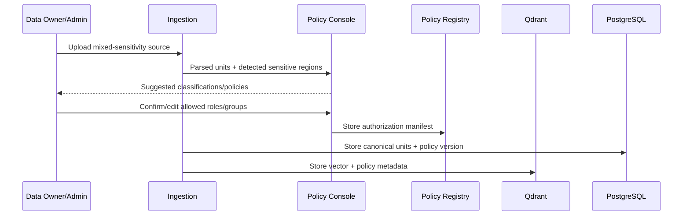
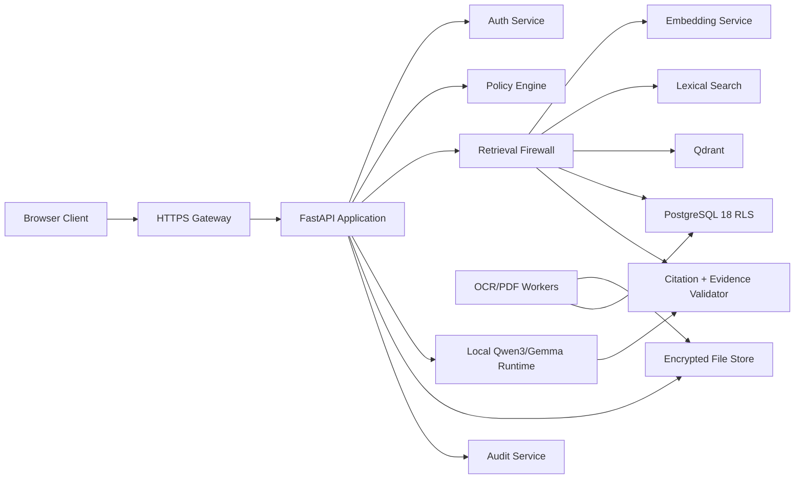
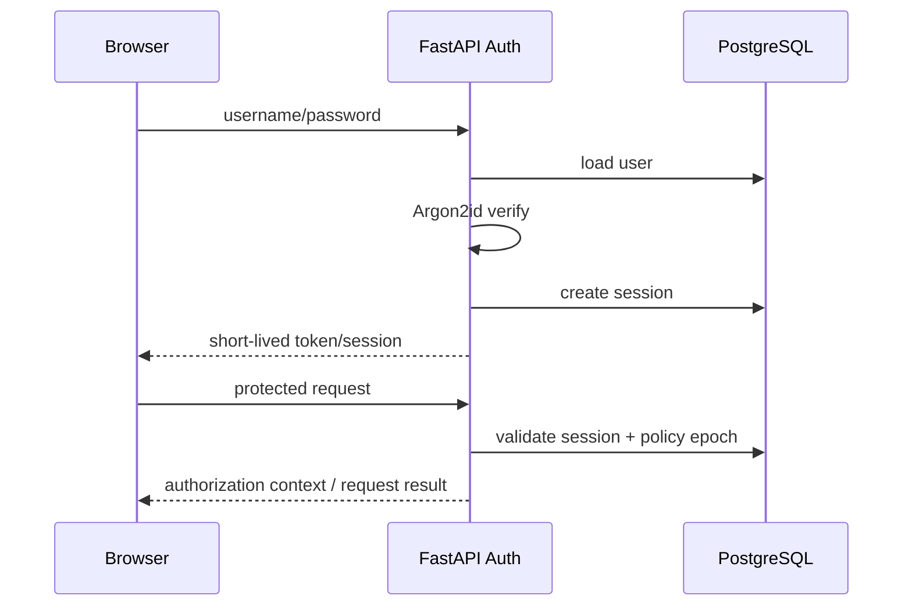
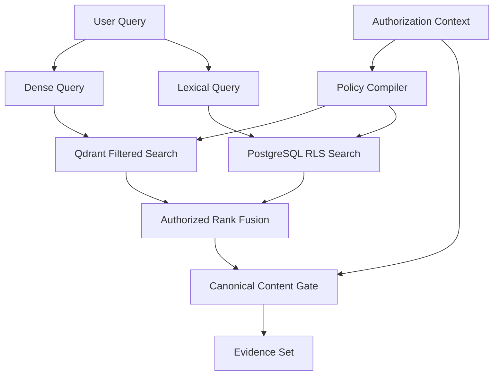
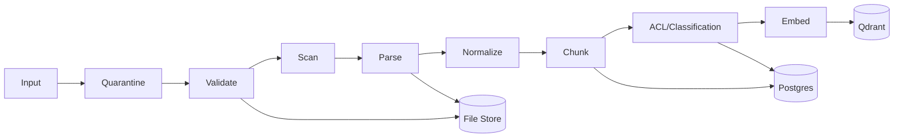
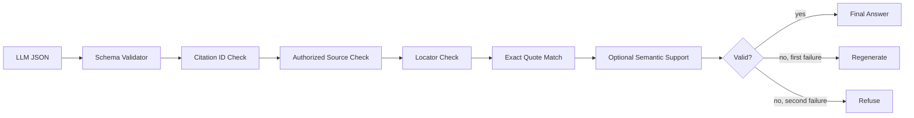
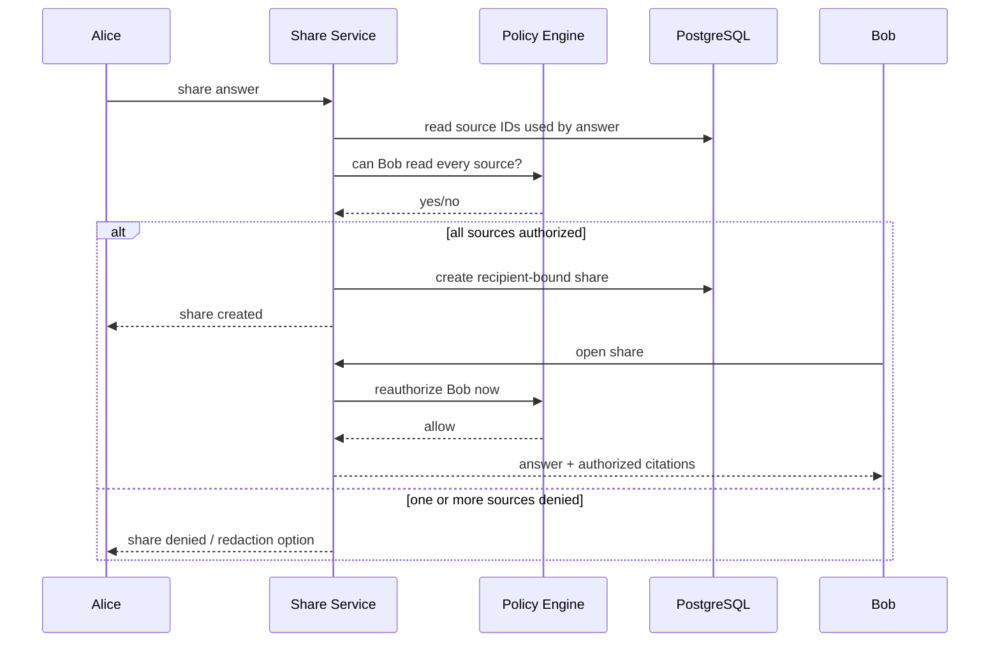

# Secure Multi-Modal RAG — Detailed Data-Authorization Architecture Specification

## Architecture Pack v2.0

> **Primary design objective:** authorization is a property of the data being retrieved, not merely a property of the logged-in user. RBAC authenticates coarse privileges; data manifests, ACLs, classifications and ABAC rules determine whether each resource/row/field/chunk/span may enter retrieval and model context.

This document is the implementation-level architecture for the master project specification.

---

# 1. Architecture Principles

1. **Zero cloud dependency at runtime.**
2. **LAN is transport, not trust.**
3. **RBAC decides what a user can do; ABAC/resource ACLs decide which objects can be touched.**
4. **Authorization is compiled before retrieval.**
5. **The retriever is a security boundary.**
6. **The canonical source store is a second security boundary.**
7. **The LLM has no authority to grant access.**
8. **Evidence is immutable/versioned enough to make citations reproducible.**
9. **Every factual answer is evidence-backed or refused.**
10. **Clients can reach only the gateway, not internal infrastructure.**

NIST’s zero-trust architecture explicitly says network location should not grant implicit trust, including local networks. [NIST SP 800-207](https://csrc.nist.gov/pubs/sp/800/207/final)

---


# 1.1 DATA AUTHORIZATION FABRIC

The architecture adds a dedicated **Data Authorization Fabric (DAF)** between ingestion, indexing, retrieval and generation.

```text
                    ┌──────────────────────────────┐
                    │     SUBJECT ATTRIBUTES        │
                    │ user / roles / groups /      │
                    │ department / clearance /     │
                    │ grants / session / policy    │
                    └───────────────┬──────────────┘
                                    │
                                    ▼
┌─────────────────────────────────────────────────────────────────┐
│                    DATA AUTHORIZATION FABRIC                    │
│                                                                 │
│  Resource Policy Registry                                      │
│  ├─ document ACL                                               │
│  ├─ row ACL                                                    │
│  ├─ field/column policy                                        │
│  ├─ chunk/segment ACL                                          │
│  ├─ OCR region policy                                          │
│  └─ classification/clearance                                  │
│                                                                 │
│  Policy Compiler → Authorization Filter AST                    │
│  Policy Evaluator → ALLOW / DENY / REDACT                     │
│  Policy Epoch Manager → revocation consistency                 │
└───────────────┬─────────────────────────────────────────────────┘
                │
       ┌────────┴─────────┐
       ▼                  ▼
 Qdrant filter       PostgreSQL RLS / canonical gate
       │                  │
       └────────┬─────────┘
                ▼
        AUTHORIZED EVIDENCE
                │
                ▼
        Local LLM generation
                │
                ▼
       Citation/output gate
```

## 1.2 AUTHORIZATION MANIFEST SCHEMA

Use one normalized policy model across modalities.

```text
resource_policy
├── resource_id
├── tenant_id
├── parent_resource_id
├── object_type
├── classification
├── min_clearance
├── allowed_users[]
├── allowed_groups[]
├── allowed_roles[]
├── denied_users[]
├── denied_groups[]
├── allowed_operations[]
├── deny_operations[]
├── conditions
│   ├── valid_from
│   ├── valid_until
│   ├── project_id
│   └── environment constraints
├── policy_version
└── acl_version
```

For a child chunk/span:

```text
child_effective_policy = parent_effective_policy ∩ local_policy
```

If the intersection is ambiguous, **deny** rather than broaden.

## 1.3 POLICY GRANULARITY BY MODALITY

| Modality | Minimum secure unit | Provenance |
|---|---|---|
| PDF | page/section/chunk | file hash + page + block + char offsets |
| image/OCR | region/span/chunk | image hash + page/frame + bbox + OCR offsets |
| database | row/column | table + primary key + column |
| CSV/Excel | row/cell group | sheet + row + cell range |
| text | paragraph/chunk | file hash + offsets |

## 1.4 SAFE CHUNKING ALGORITHM

The chunker must be **authorization-aware** rather than purely token-count based.

```text
parse source
   ↓
extract atomic content units
   ↓
assign source policy
   ↓
detect explicit protected spans/fields/regions
   ↓
split whenever effective policy changes
   ↓
create chunk boundaries only inside one policy domain
   ↓
attach provenance + ACL/classification
   ↓
embed
```

This deliberately sacrifices some retrieval recall to prevent cross-policy contamination.

### Example

```text
Paragraph:
"Project Alpha revenue was ₹8 crore. CFO password: SECRET."
```

Do NOT create one embedding.

Create:

```text
chunk-A = "Project Alpha revenue was ₹8 crore."
policy  = project_members

chunk-B = "CFO password: SECRET."
policy  = security_admin
rag_context = false
```

This is one of the strongest implementation differences between a normal RAG system and this security-first project.

## 1.5 SECURITY-CLASSIFIED EMBEDDING STRATEGY

Do not place full source text into Qdrant payload when it is unnecessary.

Store:

```text
vector
resource_id
chunk_id
policy_hash
classification
tenant_id
acl_selector
acl_version
content_hash
```

Keep canonical text in PostgreSQL/file/object storage behind the authorization gateway.

Even embeddings should be treated as sensitive derived data: recent research continues to examine embedding inversion and privacy leakage risks. A 2026 COMPSAC paper explores access control through key-parametrized embeddings, while another 2026 paper proposes shadow-query embeddings as a defense against embedding inversion. These are promising research directions, but the baseline architecture should rely on authorization filtering plus protected canonical storage rather than assuming embeddings are harmless. [COMPSAC 2026: Key-Parametrized Embeddings](https://orbilu.uni.lu/handle/10993/69191) | [Shadow Queries for Private Retrieval](https://arxiv.org/abs/2609.04767)

## 1.6 RETRIEVAL FIREWALL API CONTRACT

The secure retriever should have an API that makes policy injection from the client difficult.

Bad:

```python
search(query, filters=request.filters)
```

Preferred:

```python
secure_search(
    query=query,
    authorization_context=authz,
    purpose="rag_context"
)
```

The policy compiler derives the filter internally.

Conceptual flow:

```python
query_embedding = embed(query)
policy_ast = policy_engine.compile(authz, action="rag_context")
vector_hits = qdrant.search(
    vector=query_embedding,
    filter=policy_ast.to_qdrant_filter(),
    limit=50,
)
verified = canonical_gate.verify_and_load(vector_hits, authz)
evidence = evidence_builder.build(verified)
```

No client parameter may directly widen `policy_ast`.

## 1.7 POST-RETRIEVAL CANONICAL GATE

The vector filter is necessary but not sufficient.

```text
Qdrant candidate
    ↓
resource/chunk lookup
    ↓
current ACL version?
    ↓
current policy decision?
    ↓
PostgreSQL RLS / field policy
    ↓
content hash/version verified?
    ↓
ALLOW → evidence
DENY  → candidate discarded
```

This protects against stale metadata, ACL race conditions, partial index updates and accidental Qdrant misconfiguration.

## 1.8 FIELD-LEVEL DATA PROTECTION

For structured sources, represent fields independently when needed:

```text
employee:E102:name
employee:E102:department
employee:E102:salary
employee:E102:bank_account
```

or maintain one row with a field-policy map:

```json
{
  "resource_id": "employee:E102",
  "fields": {
    "name": {"policy": "employees"},
    "department": {"policy": "employees"},
    "salary": {"policy": "managers"},
    "bank_account": {"policy": "hr_security"}
  }
}
```

The backend should project only authorized fields into the evidence envelope.

## 1.9 OCR REGION AUTHORIZATION

The OCR worker should retain region-level provenance:

```text
image_hash
page/frame
bbox
ocr_text
confidence
region_id
policy_ref
```

If OCR detects a protected region, the region receives its own policy. Do not OCR an entire image into a single authorization-blind text block.

## 1.10 REVOCATION CONSISTENCY

Every authorization-sensitive index object carries:

```text
policy_version
acl_version
content_version
```

At query time:

```text
request.policy_epoch
    ↓
compare with current policy epoch
    ↓
if stale → rebuild/refresh authorization context
```

At evidence load time:

```text
candidate.acl_version
      vs
current_acl_version(resource)
```

Mismatch means re-evaluate rather than trust stale payload.

## 1.11 AUTHORIZATION-AWARE CACHE

Cache key:

```text
H(
  tenant_id,
  principal_id,
  policy_epoch,
  normalized_query,
  retriever_version,
  model_version
)
```

For even stricter isolation, disable final-answer caching for high-sensitivity resources in the hackathon build.

## 1.12 INFERENCE / AGGREGATE GUARD

Authorization can fail even when individual rows are technically hidden.

Implement:

```text
SensitiveQueryGuard
├── detect sensitive fields
├── detect aggregate requests
├── detect comparisons
├── track recent query history
├── enforce group-size threshold
└── return SAFE_REFUSAL when inference risk is high
```

The guard runs before SQL generation/retrieval for structured queries and before final generation for mixed-source questions.

## 1.13 DATA-SHARING ARCHITECTURE

```text
Sender
  ↓
share resource/reference
  ↓
recipient authenticates
  ↓
recipient policy evaluated
  ↓
recipient-specific evidence/view generated
  ↓
expiring access token/reference
```

No direct file path sharing.

## 1.14.1 DATA POLICY CONSOLE FLOW



The policy registry is the authoritative source for data access rules. Qdrant receives the minimum metadata required to pre-filter retrieval.

## 1.14.2 DATA POLICY DSL

For a strong implementation, define a tiny internal policy language instead of scattering ACL logic throughout the codebase.

```yaml
policy_id: salary-hr-v3
resource_pattern: finance.salary.*
classification: restricted
allow:
  roles: [hr]
  groups: [hr-managers]
  users: []
deny:
  roles: [guest, viewer]
operations:
  read: true
  rag_context: true
  download: false
  share: false
conditions:
  min_clearance: 3
```

The policy compiler translates this to:

```text
Policy DSL
   ↓
Normalized AST
   ├── PostgreSQL predicates / RLS context
   ├── Qdrant filter
   ├── canonical projection
   └── output policy
```

This prevents each service from inventing its own interpretation of “HR-only”.

## 1.14.3 AUTHORIZATION PROOF OBJECT

For every evidence item, internally create a proof record:

```json
{
  "evidence_id": "ev_902",
  "principal_id": "u_17",
  "resource_id": "res_salary_44",
  "policy_version": 38,
  "acl_version": 12,
  "decision": "ALLOW",
  "matched_rules": ["HR_ONLY"],
  "checked_at": "2026-10-07T12:00:00Z"
}
```

The full proof stays in the audit/security layer. The LLM receives only the evidence content and safe citation locator.

This makes the hackathon demo much more compelling because you can show **why** a piece of information was allowed without exposing the protected policy internals to the user.

## 1.14 THREAT-TO-COMPONENT MATRIX

| Threat | Primary defense |
|---|---|
| user changes role in frontend | server-side principal context |
| custom vector filter | policy compiler owns filter |
| stale ACL in vector DB | canonical authorization gate |
| mixed sensitive/public chunk | policy-aware chunking |
| sensitive DB column leakage | field-level policy + RLS/projection |
| hidden OCR region leakage | region-level ACL |
| malicious document prompt | untrusted-context isolation |
| prompt asks model to ignore ACL | LLM has no authorization authority |
| cache cross-user leak | principal + policy epoch in key |
| revoked access | policy epoch + ACL version + canonical check |
| embedding theft | minimal payload + protected vector service |
| inference through aggregates | sensitive-query guard |
| fabricated citation | citation validator |
| unauthorized citation | authorization check on evidence ID |
| file URL guessing | opaque IDs + authorization streaming |

# 2. Logical Architecture



---

# 3. Deployment Architecture

Recommended one-server hackathon deployment:

```text
                    PRIVATE LAN
        ┌─────────────────────────────────┐
        │                                 │
        │  User Laptop / Phone / Browser  │
        │             │ HTTPS             │
        │             ▼                   │
        │   ┌──────────────────────┐      │
        │   │ Caddy / Nginx :443   │      │
        │   └──────────┬───────────┘      │
        │              ▼                  │
        │   ┌──────────────────────┐       │
        │   │ FastAPI :8000        │       │
        │   │ Auth + Policy + RAG  │       │
        │   └───┬─────┬─────┬─────┘       │
        │       │     │     │              │
        │       ▼     ▼     ▼              │
        │    Qdrant   PG    LLM             │
        │    :6333    :5432  :8080          │
        │                                     │
        │    OCR / storage / audit           │
        │                                     │
        └─────────────────────────────────────┘
```

The client should be allowed to reach only TCP 443.

Everything else should be:

- loopback only;
- Docker internal network;
- or firewall restricted to localhost/service accounts.

---

# 4. Service Network Segmentation

Use three logical networks even on one physical host:

```text
frontend-net
backend-net
storage-net
```

Conceptually:

```text
frontend-net
  └── gateway

backend-net
  ├── fastapi
  └── llm

storage-net
  ├── postgres
  ├── qdrant
  ├── storage worker
  └── audit
```

The browser should never join the backend/storage network.

---

# 5. Trust Boundaries

## TB-1 Browser → Gateway

Trust assumptions:

- browser input is untrusted;
- network may be hostile;
- authentication must occur before protected actions.

Controls:

- HTTPS;
- server-side validation;
- secure session/token handling;
- CSRF protection for cookie-based state-changing operations.

## TB-2 Gateway → Retrieval Firewall

This is an internal trust boundary.

The retrieval firewall receives an immutable `AuthorizationContext`.

Controls:

- typed authorization object;
- policy epoch;
- no client-supplied filter;
- mandatory permission check.

## TB-3 Retrieval Firewall → Qdrant

Qdrant is a trusted internal search service, not a user-facing authorization system.

Controls:

- API key;
- TLS where network transport exists;
- network isolation;
- payload filter required;
- minimal payload design.

Qdrant self-hosted security must be explicitly configured. [Qdrant Security](https://qdrant.tech/documentation/security/)

## TB-4 Retrieval Firewall → PostgreSQL

Controls:

- private DB network;
- least-privilege DB role;
- PostgreSQL RLS;
- request-local principal context;
- parameterized queries.

## TB-5 App → LLM

The LLM is not trusted for authorization.

Controls:

- only approved evidence enters context;
- no tools that modify permissions;
- structured output schema;
- citation validator.

## TB-6 Storage → Download

Controls:

- authorization on every download;
- opaque resource IDs;
- no public filesystem paths;
- secure streaming.

---

# 6. Component Responsibilities

| Component | Responsibility | Must not do |
|---|---|---|
| Gateway | TLS termination, routing | make data authorization decisions by itself |
| FastAPI | orchestration, endpoint security | trust frontend roles |
| Auth | identity/session | decide document access alone |
| Policy Engine | permission decisions | generate natural-language answers |
| Retrieval Firewall | authorized search | bypass policy |
| Qdrant | vector search | serve clients directly |
| PostgreSQL | authoritative records + RLS | expose DB directly |
| OCR worker | parsing/OCR | execute document content |
| LLM | language generation | grant access |
| Citation Validator | evidence validation | modify authorization |
| Audit | security trail | store full secrets |
| File Store | source blobs | public HTTP serving |

---

# 7. Identity Model

## Principal

```text
Principal
├── user_id
├── tenant_id
├── username
├── account_state
├── clearance
├── role_ids
├── group_ids
└── policy_epoch
```

## Authorization context

```text
AuthorizationContext
├── principal_id
├── tenant_id
├── role_ids
├── group_ids
├── clearance
├── effective_permissions
├── policy_epoch
└── session_id
```

The context is created after authentication and current policy evaluation.

Never create it by simply decoding an unverified JWT.

---

# 8. Authentication Sequence



Password hashing should use Argon2id, not plaintext or fast hashes such as raw SHA-256. [OWASP Password Storage](https://cheatsheetseries.owasp.org/cheatsheets/Password_Storage_Cheat_Sheet.html)

---

# 9. Authorization Decision Pipeline

```text
request
  ↓
identity
  ↓
account active?
  ↓
session valid?
  ↓
policy epoch current?
  ↓
action permission present?
  ↓
resource attributes
  ↓
explicit deny?
  ↓
role/group/user/owner relationship
  ↓
clearance/classification
  ↓
ALLOW / DENY
```

The policy engine should return a machine-readable result:

```json
{
  "decision": "allow",
  "policy_id": "finance-read-v3",
  "policy_epoch": 41,
  "reason_code": "GROUP_MATCH_AND_CLEARANCE"
}
```

For an ordinary user, the API should not expose sensitive policy internals. Audit logs may retain them securely.

---

# 10. Policy Engine Shape

Recommended internal interfaces:

```python
class PolicyEngine:
    def get_effective_permissions(self, principal): ...
    def can_action(self, principal, action, resource): ...
    def compile_retrieval_filter(self, principal, scope): ...
    def can_download(self, principal, resource_id): ...
    def can_share(self, principal, resource_ids, recipient): ...
```

The same source of truth should power:

- UI capabilities;
- retrieval filters;
- downloads;
- source viewer;
- sharing;
- admin operations.

But UI capabilities are advisory. The server repeats enforcement on every request.

OWASP’s authorization pattern guidance separates policy decision and enforcement components and emphasizes keeping enforcement close to the protected resource. [OWASP Authorization Patterns](https://cheatsheetseries.owasp.org/cheatsheets/Authorization_Patterns_Cheat_Sheet.html)

---

# 11. Retrieval Firewall Architecture



The firewall must prevent this forbidden graph:

```text
QRY → Qdrant(all data) → filter later
```

and this forbidden graph:

```text
QRY → LLM → decide whether data is allowed
```

---

# 12. Qdrant Data Plane

Store only the data necessary for retrieval:

```text
vector
chunk_id
resource_id
tenant_id
classification
min_clearance
acl_subjects
deny_subjects
acl_version
content_version
content_hash
```

Indexes:

```text
tenant_id      keyword
classification integer
acl_subjects   keyword
min_clearance  integer
resource_id    keyword
acl_version    integer
```

Qdrant payload indexes improve filtered search performance and allow filtering to participate in query planning. [Qdrant Filtering](https://qdrant.tech/documentation/search/patterns/vector-search-filtering/)

---

# 13. Qdrant Filter Strategy

For a principal:

```text
principal_subjects =
[
  user_id,
  role ids,
  group ids,
  department/project policy tags
]
```

Filter:

```text
must:
    tenant_id == principal.tenant_id
    min_clearance <= principal.clearance

must_not:
    deny_subjects intersects principal_subjects

should:
    acl_subjects intersects principal_subjects
```

The exact Qdrant filter syntax depends on the client version. Keep filter creation inside one tested module and add tests from the real serialized filter requests.

---

# 14. Canonical Content Gate

After vector/lexical ranking:

```text
candidate chunk IDs
       ↓
load chunk registry
       ↓
resource status ACTIVE?
       ↓
content version current?
       ↓
ACL version current?
       ↓
policy allows read?
       ↓
PostgreSQL RLS row visible?
       ↓
load canonical text
```

If a vector candidate disappears at this stage, do not tell the user:

> “Candidate 9 was forbidden.”

Return only the final authorized evidence set.

---

# 15. PostgreSQL RLS Architecture

Use PostgreSQL as the authoritative enforcement point for structured rows.

## Request context

The app opens a transaction and sets request-local context:

```sql
SET LOCAL app.user_id = 'u_123';
SET LOCAL app.tenant_id = 't_1';
SET LOCAL app.clearance = '2';
```

Then RLS policies use `current_setting()`.

Important implementation details:

- use a dedicated application DB role;
- do not use the database owner for normal queries;
- consider `FORCE ROW LEVEL SECURITY`;
- use parameterized SQL;
- do not expose PostgreSQL to LAN clients.

PostgreSQL 18 documents `USING` and `WITH CHECK` policies and default-deny behavior when no applicable policy exists. [PostgreSQL RLS](https://www.postgresql.org/docs/18/ddl-rowsecurity.html) | [CREATE POLICY](https://www.postgresql.org/docs/current/sql-createpolicy.html)

---

# 16. Structured Data Ingestion

Suppose the source table is:

```text
transactions
id
customer
amount
department
classification
```

Create a canonical chunk text:

```text
Transaction ID: TX-1009
Customer: Example Industries
Amount: 184000
Department: Finance
Classification: Confidential
```

Metadata remains authoritative in PostgreSQL.

This row becomes one or more searchable chunks depending on row size.

When a user asks:

> Which transaction was largest?

the dense and lexical retrievers work over searchable representations, but the final record still comes from a currently authorized row.

---

# 17. Multi-Modal Ingestion Graph



---

# 18. PDF Pipeline

```text
PDF bytes
  ↓
signature validation
  ↓
page count limit
  ↓
fast parser
  ├── text layer present → extract text
  └── text absent        → OCR
  ↓
layout/table extraction as needed
  ↓
provenance mapping
  ↓
chunking
```

Store page-level locators so a citation can say:

```text
Finance Report.pdf — Page 7 — paragraph 4
```

---

# 19. Image/OCR Pipeline

```text
image bytes
 ↓
image signature
 ↓
decoding limits
 ↓
OCR
 ↓
blocks + confidence
 ↓
normalization
 ↓
chunking
 ↓
embedding
```

Do not use a cloud OCR API.

For simple text, Tesseract is the easiest local baseline. For better document layout and table extraction, evaluate PaddleOCR/Docling locally.

---

# 20. Ingestion Quarantine

Quarantine directory:

```text
storage/quarantine/<random-id>
```

Never:

```text
storage/quarantine/<user-filename>
```

Validation gates:

```text
file size
file count
MIME
magic/signature
filename length
path traversal
page count
image pixels
compression ratio
parser timeout
AV result
```

OWASP recommends content validation, size limits, authorized uploads, randomized filenames and safe storage. [OWASP File Upload](https://cheatsheetseries.owasp.org/cheatsheets/File_Upload_Cheat_Sheet.html)

---

# 21. File Parser Isolation

Document parsers are another attack surface.

Preferred approach:

```text
FastAPI
  ↓ queue
parser worker
  ↓
restricted process/container
```

Worker permissions:

- no database admin credential;
- no ability to call the internet;
- access only to its temporary input/output directories;
- CPU/memory/time limits.

This means a parser vulnerability has a smaller blast radius.

---

# 22. Local LLM Service

Use a dedicated internal endpoint:

```text
http://127.0.0.1:8080
```

or an isolated Docker service.

The application should expose a model adapter:

```python
class LocalLLM:
    def generate_structured(self, messages, schema): ...
```

This lets you swap:

```text
Qwen3-4B
Gemma 3 4B
smaller fallback
```

without changing the security pipeline.

llama.cpp supports local GGUF inference and a local server mode, including CPU/GPU hybrid execution. [llama.cpp](https://github.com/ggml-org/llama.cpp)

---

# 23. Model Memory Budget

Target profile:

```text
GPU VRAM: 4 GB
System RAM: at least 16 GB recommended

LLM: ~2–3 GB quantized weights
KV/cache/context: remaining memory budget
Embedding: CPU
OCR: CPU
Database: CPU/RAM
Vector DB: CPU/RAM
```

The exact VRAM footprint depends on backend, model build, context size, GPU offload and batch size.

Start conservatively:

```text
context = 4096
batch = 1
parallel generations = 1
max tokens = 256–512
```

Increase only after measuring real memory usage.

---

# 24. Evidence Context Builder

The context builder is security-sensitive.

Input:

```text
authorized chunks only
```

Output:

```text
[EVIDENCE S1]
Type: PDF
Locator: page 7
Text: ...

[EVIDENCE S2]
Type: DB_ROW
Locator: transaction TX-1009
Text: ...
```

Never accept a chunk directly from the browser.

Never let the browser submit arbitrary source IDs to the context builder.

---

# 25. Citation Validator Architecture



The model’s response is never rendered directly.

---

# 26. Exact Quote Verification Algorithm

Normalize both stored source and model quote:

```text
NFKC unicode normalization
↓
normalize line endings
↓
collapse repeated whitespace
↓
trim
```

Then:

```python
normalized_quote in normalized_source_span
```

Also compare:

```text
resource_id
chunk_id
page/row locator
content_hash
content_version
```

If the hash/version no longer matches, the citation becomes stale and must be regenerated from the current source.

---

# 27. Claim Coverage Rule

Every answer segment is represented internally as:

```json
{
  "text": "The Q3 budget is 18.5 million.",
  "claim_type": "factual",
  "citations": ["S1"]
}
```

The validator rejects:

```json
{
  "text": "The Q3 budget is 18.5 million and the CEO approved it personally.",
  "citations": ["S1"]
}
```

when S1 only supports the budget number.

For a first hackathon implementation, the easiest strong constraint is to force the model to output one claim per answer line and attach citations to each line.

---

# 28. Refusal States

Different refusal reasons should exist internally:

```text
NO_AUTHORIZED_SOURCES
INSUFFICIENT_EVIDENCE
CITATION_FAILURE
SOURCE_CONTRADICTION
POLICY_DENIED
RESOURCE_STALE
SYSTEM_OVERLOAD
```

But user-facing messages should be privacy-safe.

Examples:

```text
I cannot answer that from the sources you are authorized to access.
```

or:

```text
The authorized sources do not contain enough evidence to answer reliably.
```

---

# 29. Answer Security Lifecycle

```text
USER QUERY
  ↓
AUTHORIZATION
  ↓
AUTHORIZED RETRIEVAL
  ↓
EVIDENCE MINIMIZATION
  ↓
LLM GENERATION
  ↓
SCHEMA VALIDATION
  ↓
CITATION VALIDATION
  ↓
OPTIONAL SEMANTIC SUPPORT
  ↓
DLP POLICY
  ↓
RENDER
```

No shortcut should bypass this lifecycle for sensitive answers.

---

# 30. Share Architecture



At view time, authorization is repeated. A share does not permanently freeze access.

---

# 31. Share Token Model

Use:

```text
share_token = 256-bit random value
stored_hash = H(share_token)
```

The URL may contain only the opaque token.

Never put:

```text
user_id
resource_id
role
classification
```

into a share URL.

The token is only a lookup capability; authorization still happens against current policy.

---

# 32. Cache Model

Version 1:

```text
NO GLOBAL ANSWER CACHE
```

Version 2:

```text
cache key =
 principal_id
 + policy_epoch
 + normalized_query
 + source_version_set
 + model_version
 + prompt_version
```

Source excerpts must never be shared between principals unless the cache entry is intentionally scoped to a shared authorization context.

---

# 33. Audit Architecture

Use PostgreSQL for structured audit storage:

```text
request_id
actor_id
session_id
action
object_type
object_id
decision
policy_version
reason_code
timestamp
client_ip
```

Add a hash chain if you want an impressive integrity feature:

```text
previous_hash
current_hash
```

Example:

```text
H(n) = SHA256(H(n-1) || canonical_event_json)
```

This detects modifications to the chain, though it does not by itself stop an attacker with write access to the whole database from deleting or rebuilding the chain. Use secure log access and backups for stronger guarantees.

---

# 34. Network Security Matrix

| Service | Port | Client-visible? | Binding |
|---|---:|---|---|
| HTTPS gateway | 443 | Yes | LAN/private |
| FastAPI | 8000 | No | localhost/internal |
| Qdrant | 6333 | No | localhost/internal |
| Qdrant gRPC | 6334 | No | localhost/internal |
| PostgreSQL | 5432 | No | private/local |
| LLM | 8080 | No | localhost/internal |
| ClamAV local socket | local | No | local only |

Only 443 should be reachable from ordinary clients.

---

# 35. TLS Architecture

Use:

```text
Local CA
  ↓
server certificate: rag-server.local
  ↓
HTTPS gateway
```

For a classroom/hackathon LAN, a local CA is preferable to asking every browser user to ignore certificate warnings.

For admin service identity, optional mTLS can be added later.

OWASP recommends TLS 1.3 and says mTLS adds client authentication when needed. [OWASP TLS](https://cheatsheetseries.owasp.org/cheatsheets/Transport_Layer_Security_Cheat_Sheet.html)

---

# 36. Offline Mode

The final deployment should support:

```text
firewall outbound DENY
```

while still allowing:

```text
LAN → HTTPS gateway
internal services → local services
```

Test this explicitly:

```text
1. Disconnect Internet.
2. Login.
3. Upload document.
4. OCR it.
5. Index it.
6. Ask question.
7. Receive local answer.
8. Open verified citation.
```

This becomes one of the project’s strongest demo moments.

---

# 37. Docker Compose Architecture

Conceptual services:

```text
reverse-proxy
backend
worker-parser
worker-ocr
postgres
qdrant
llm
```

Volumes:

```text
postgres_data
qdrant_data
encrypted_files
quarantine
models
```

Networks:

```text
edge_net
backend_net
storage_net
```

Do not publish internal ports except where absolutely required.

---

# 38. Resource Limits

Parser workers:

```text
CPU: 1–2 cores
RAM: 1–2 GB
job timeout: 60–180s
```

LLM:

```text
GPU: 4GB target
parallelism: 1
context: 4K starting point
```

Backend:

```text
request body limit
query length limit
upload size limit
concurrency limit
```

These are starting values, not universal requirements.

---

# 39. Database Transaction Boundaries

## Upload transaction

1. create resource
2. create version
3. create ACL
4. create chunk registry
5. commit metadata
6. index vectors
7. set resource ACTIVE only after indexing success

If vector indexing fails, do not mark the resource fully active.

## Permission change transaction

1. update ACL/role
2. increment policy/resource epoch
3. invalidate affected sessions/caches
4. update Qdrant ACL metadata or mark reindex required
5. commit audit event

---

# 40. Permission Revocation Flow

This flow is critical.

```text
Admin revokes Alice's Finance access
        ↓
Postgres ACL update
        ↓
resource ACL version increments
        ↓
user policy epoch increments if user-wide
        ↓
cache invalidation
        ↓
Qdrant ACL metadata refresh
        ↓
Alice's next query
        ↓
new authorization context
        ↓
new filter
        ↓
old evidence unavailable
```

The canonical gate should still stop any stale Qdrant result that survived a race.

This is why the second authorization gate matters.

---

# 41. Permission Grant Flow

```text
Admin grants Bob access
 ↓
policy change
 ↓
epoch/version update
 ↓
Qdrant metadata updated
 ↓
new request receives current context
 ↓
Bob can retrieve source
```

Do not require the model to know anything about the grant.

---

# 42. Race Condition Handling

Possible race:

```text
T1: Alice query starts
T2: Admin revokes Alice
T3: Qdrant returns old candidate
T4: Backend loads canonical source
```

Solution:

At T4, canonical authorization uses the latest committed policy.

Therefore source access is denied even if the vector index is briefly stale.

This is another reason Qdrant should not be treated as the final authority.

---

# 43. Authorization-Aware Hybrid Search

Recommended execution:

```text
                query
                 |
        +--------+---------+
        |                  |
        v                  v
 dense embedding       lexical parse
        |                  |
        v                  v
   Qdrant filter       PostgreSQL RLS
        |                  |
        +--------+---------+
                 |
                 v
          rank fusion
                 |
          candidate IDs
                 |
                 v
        canonical RLS gate
                 |
                 v
             evidence
```

Dense and lexical ranking can be normalized before Reciprocal Rank Fusion.

Do not let score values or hidden candidate counts leak into the UI.

---

# 44. Retrieval Oversampling

Use a larger candidate pool before the final top-k evidence selection.

Example:

```text
Qdrant candidate_k = 50
lexical candidate_k = 50
fusion = top 30 unique
canonical authorization
final evidence = 6
```

Why oversample?

Because even with correct pre-filtering, some candidates may be:

- stale;
- revoked between stages;
- low-confidence OCR;
- duplicate chunks;
- superseded versions.

Do not simply query top-5 and assume the answer is good.

---

# 45. Source Diversity Rule

Avoid returning six chunks from one nearly identical section when multiple independent sources exist.

Possible scoring rule:

```text
final_score =
    0.60 * dense_rank_score
  + 0.30 * lexical_score
  + 0.10 * provenance/diversity score
```

These weights are starting points only.

A source diversity rule can prefer:

```text
max 3 chunks/resource
```

so the LLM gets independent evidence.

---

# 46. Evidence Minimization

Before generation:

- remove duplicate chunks;
- clip irrelevant paragraphs;
- keep only the citation span plus necessary context;
- remove authorization metadata;
- remove internal IDs not needed by the model.

This improves both security and small-model performance.

---

# 47. Data Minimization Example

Instead of feeding:

```text
Entire 30-page Finance.pdf
```

feed:

```text
S1 page 7 budget paragraph
S2 page 8 approval table row
S3 page 3 Q3 definition
```

This reduces context size and limits what a prompt-injected model could potentially repeat.

---

# 48. Prompt Boundary Format

Use a hard delimiter:

```text
===== SYSTEM RULES =====
...
===== END SYSTEM RULES =====

===== EVIDENCE DATA =====
[S1]
...
[S2]
...
===== END EVIDENCE DATA =====

===== USER REQUEST =====
...
===== END USER REQUEST =====
```

The evidence section should always be explicitly labeled as data.

Microsoft recommends separating instructions from retrieved context and treating retrieved chunks as adversarial/untrusted input. [Microsoft RAG Prompt Engineering](https://learn.microsoft.com/en-us/azure/architecture/ai-ml/guide/rag/rag-prompt-engineering)

---

# 49. Model Capability Boundaries

The LLM should have:

```text
NO filesystem access
NO database access
NO Qdrant access
NO shell access
NO network tools
NO role-management tools
NO document download tool
```

It receives:

```text
question + authorized evidence
```

and produces:

```text
structured grounded answer
```

This is a major reduction of attack surface and is aligned with the principle that untrusted model output should not directly drive privileged actions. [OWASP GenAI risks](https://genai.owasp.org/llm-top-10/)

---

# 50. Optional Image Understanding Upgrade

Phase 2 can support Gemma 3 4B as a visual model:

```text
image
 ↓
OCR text
 +
visual summary
 ↓
canonical multi-modal representation
 ↓
embedding/search
```

Even then, keep OCR as an explicit evidence channel because:

- OCR gives exact textual provenance;
- page/block citations are easier;
- visual model output should not be considered the authoritative source text.

Gemma 3 is documented as multimodal with text/image input and multilingual support. [Gemma 3](https://huggingface.co/google/gemma-3-4b-it)

---

# 51. Optional pgvector Alternative

If Qdrant adds too much deployment complexity:

```text
PostgreSQL 18
  + pgvector
  + RLS
  + full-text search
```

pgvector supports exact search plus HNSW and IVFFlat approximate indexes. [pgvector](https://github.com/pgvector/pgvector)

This can create a very strong “single protected data plane” design.

Tradeoff:

- less obvious dedicated vector-store story;
- potentially simpler authorization consistency.

For the hackathon’s explicit vector DB emphasis, Qdrant remains the recommended main path.

---

# 52. Current 4-GB Model Decision

## Primary

```text
Qwen3-4B-Instruct-2507
GGUF
Q4_K_M
```

## Fallback

```text
Gemma 3 4B IT
GGUF
Q4_K_M
```

## Emergency low-memory fallback

```text
1–2B class local instruction model
```

The architecture must not depend on a specific model name.

This is essential because hardware and model packaging will continue to change.

---

# 53. Embedding Decision

Default:

```text
intfloat/multilingual-e5-small
384-d
CPU
```

Use:

```text
query: <question>
passage: <chunk>
```

because the model card says the retrieval prefixes are part of the training setup. [multilingual-e5-small](https://huggingface.co/intfloat/multilingual-e5-small)

English-only alternative:

```text
BAAI/bge-small-en-v1.5
384-d
```

[BGE-small](https://huggingface.co/BAAI/bge-small-en-v1.5)

---

# 54. Performance Targets

Initial hackathon targets on a single modest server:

```text
login p95: < 500 ms
metadata authorization: < 100 ms
vector retrieval: < 300 ms
lexical retrieval: < 150 ms
citation validation: < 100 ms
first token: hardware dependent
```

The local LLM will dominate end-to-end latency.

Therefore optimize:

1. context size;
2. retrieval count;
3. generation token cap;
4. model quantization;
5. request concurrency.

---

# 55. API Contract (Internal Architecture)

The system can use internal HTTP APIs even though there is no external/cloud API dependency.

## POST `/auth/login`

Input:

```json
{"username":"alice","password":"..."}
```

Output:

```json
{"access_token":"...","expires_in":900}
```

## POST `/rag/query`

```json
{"query":"What is the Q3 finance budget?"}
```

Output:

```json
{
  "status":"grounded",
  "answer":[...],
  "citations":[...],
  "security":{"grounded":true,"citation_validated":true}
}
```

## GET `/resources/{id}`

Returns only an authorized source excerpt.

## GET `/resources/{id}/download`

Authorization required.

## POST `/shares`

Recipient authorization checked across all source IDs before share creation.

---

# 56. Error Contract

Do not expose stack traces.

Recommended codes:

```text
AUTH_REQUIRED
AUTH_INVALID
AUTH_EXPIRED
FORBIDDEN
NOT_AVAILABLE
INVALID_INPUT
RESOURCE_REJECTED
GROUNDED_ANSWER_UNAVAILABLE
RATE_LIMITED
TEMPORARY_UNAVAILABLE
```

Use the same privacy-safe surface for “not found” and “forbidden” where existence itself is sensitive.

---

# 57. Security Headers

At the TLS gateway/application layer:

```text
Content-Security-Policy
X-Content-Type-Options: nosniff
Referrer-Policy: no-referrer
Permissions-Policy
Strict-Transport-Security (when deployment assumptions justify it)
```

Also set:

```text
Cache-Control: no-store
```

on highly sensitive responses where browser caching would be undesirable.

---

# 58. Browser Security

If authentication uses cookies:

```text
Secure
HttpOnly
SameSite=Lax/Strict
```

and use CSRF protection for state-changing requests.

If using bearer tokens in browser storage, carefully consider XSS exposure. For a security-focused enterprise-style demo, an HttpOnly secure session cookie is usually a better default than putting long-lived tokens in localStorage.

---

# 59. Structured Output Validation

Use Pydantic models:

```python
class Citation(BaseModel):
    source_id: str
    locator: str
    quote: str

class Claim(BaseModel):
    text: str
    citations: list[Citation]

class GroundedAnswer(BaseModel):
    status: Literal["grounded", "insufficient_evidence"]
    answer: list[Claim]
```

Reject unknown/unexpected fields if practical.

Do not render model JSON directly into HTML.

---

# 60. Security Trace Data Model

The UI can show a safe subset:

```json
{
  "request_id":"req_123",
  "authorization":"PASS",
  "retrieval_filter":"ATTACHED",
  "candidate_count":"hidden-or-bucketed",
  "authorized_evidence":5,
  "citation_validation":"PASS",
  "grounding":"PASS"
}
```

Do not reveal exact forbidden result counts.

---

# 61. Red-Team Test Architecture

Create a separate test package:

```text
security_tests/
├── test_authz_bypass.py
├── test_qdrant_filters.py
├── test_rls.py
├── test_prompt_injection.py
├── test_citations.py
├── test_sharing.py
├── test_cache_isolation.py
└── test_network_exposure.py
```

The CI gate should fail if any test labeled `SECURITY_CRITICAL` fails.

---

# 62. Golden Dataset for Evaluation

Create a small benchmark with known answers and ACLs:

```text
20 public documents
20 internal documents
20 finance confidential
20 HR confidential
20 engineering confidential
50 structured rows
20 images
10 adversarial sources
```

For every query, record:

```text
expected authorized sources
expected forbidden sources
expected answer facts
expected citations
expected refusal status
```

This gives you a repeatable benchmark.

---

# 63. Authorization Recall Metric

Define:

```text
Authorization Recall =
  authorized relevant sources returned
  /
  authorized relevant sources available
```

Also define the non-negotiable security metric:

```text
Unauthorized Retrieval Rate =
  unauthorized sources returned
  /
  all sources returned
```

Target:

```text
Unauthorized Retrieval Rate = 0
```

---

# 64. Citation Security Metrics

```text
Citation validity = valid citations / all citations

Unauthorized citation rate = unauthorized citations / all citations

Fabricated evidence rate = failed quote matches / all evidence quotes

Unsupported claim rate = unsupported claims / all factual claims
```

The target should be:

```text
Unauthorized citation rate = 0
Fabricated evidence rate = 0
```

---

# 65. Judge-Facing Security Narrative

Use this sequence during the presentation:

### Slide 1

“Normal RAG answers questions. Secure RAG answers only what the user is allowed to know.”

### Slide 2

Show three users and three documents.

### Slide 3

Ask a normal authorized question.

### Slide 4

Show retrieval filter construction.

### Slide 5

Attempt to query unauthorized content.

### Slide 6

Show zero unauthorized source IDs in context.

### Slide 7

Inject a malicious instruction into a PDF.

### Slide 8

Show that it remains untrusted data.

### Slide 9

Show citation validator rejecting a fabricated quote.

### Slide 10

Turn off Internet and answer locally.

This tells a much stronger story than showing only the chatbot interface.

---

# 66. Risk Register

| Risk | Probability | Impact | Mitigation |
|---|---|---|---|
| 4GB VRAM OOM | Medium | High | 4-bit model, 4K context, serial requests |
| parser vulnerability | Medium | High | sandboxed worker |
| stale ACL index | Medium | High | canonical gate + ACL epoch/version |
| prompt injection | High | Medium/High | untrusted context + no tools + validator |
| hallucinated answer | Medium | High | citation contract + validator + refusal |
| unauthorized LAN access | Medium | High | TLS + firewall + auth |
| model quality too low | Medium | Medium | hybrid retrieval + better prompt + fallback model |
| OCR errors | High | Medium | confidence + source warnings |
| Qdrant misconfiguration | Medium | High | private bind + auth + TLS |
| cache leak | Medium | High | disable cache initially |
| share exfiltration | Medium | High | per-source recipient reauthorization |
| audit log leakage | Low/Medium | High | redact sensitive fields |

---

# 67. Recommended Docker Service Security

For each service:

```text
read-only root filesystem where possible
non-root user where possible
no-new-privileges
CPU limit
memory limit
no unnecessary capabilities
private network
secret mounted separately
```

Never mount the entire host filesystem into the backend container.

---

# 68. Secrets

Secrets include:

```text
JWT signing key
Qdrant API key
Postgres password
file encryption key
TLS private key
```

Rules:

- never commit secrets;
- never put them in frontend bundles;
- use restrictive file permissions;
- rotate keys when compromised;
- keep data and keys separated where practical.

OWASP cryptographic storage guidance emphasizes secure key generation, storage, rotation and separation of keys from encrypted data. [OWASP Cryptographic Storage](https://cheatsheetseries.owasp.org/cheatsheets/Cryptographic_Storage_Cheat_Sheet.html)

---

# 69. Data Classification Model

Suggested levels:

```text
0 PUBLIC
1 INTERNAL
2 CONFIDENTIAL
3 RESTRICTED
```

A principal has:

```text
clearance = 0..3
```

A resource may additionally require explicit subject membership.

Example:

```text
classification = 2
clearance = 2
```

This is necessary but not sufficient.

A user with clearance 3 should not automatically see every confidential row if policy requires department membership.

Therefore classification and ACLs are evaluated together.

---

# 70. Attribute Model

Subject attributes:

```text
user_id
roles
groups
department
project
clearance
account_state
```

Object attributes:

```text
resource_id
classification
tenant
owner
department
project
status
```

Environment attributes if needed later:

```text
request_time
device_trust
network_segment
maintenance_mode
```

NIST ABAC explicitly considers subject, object, operation and environmental attributes. [NIST SP 800-162](https://csrc.nist.gov/pubs/sp/800/162/upd2/final)

---

# 71. Authorization Policy Examples

### Policy A

```text
role=viewer
may rag.query
if classification <= 1
```

### Policy B

```text
role=analyst
may rag.query
if department matches resource.department
AND classification <= clearance
```

### Policy C

```text
security_auditor
may audit.read
but not automatically resource.read
```

### Policy D

```text
resource owner
may resource.share
only if recipient passes source-by-source read checks
```

---

# 72. Why RBAC Alone Is Not Enough

Imagine:

```text
Alice = Analyst
Bob   = Analyst
```

Alice can read Finance-A.
Bob can read Finance-B.

A single role cannot express the whole distinction.

The system therefore needs:

```text
RBAC → action permission
ACL/ABAC → object permission
```

This is cleaner than creating hundreds of roles such as:

```text
finance_analyst_alice
finance_analyst_bob
finance_analyst_charlie
```

---

# 73. Why the LLM Must Not Perform Authorization

Bad:

```text
system: if user is admin reveal secret data
```

The model cannot reliably verify:

- current role;
- current ACL version;
- revoked access;
- resource ownership;
- row-level conditions.

Good:

```text
Policy Engine → only allowed evidence → LLM
```

The LLM simply cannot see the missing data.

---

# 74. Why Citation IDs Must Be Opaque

Do not expose:

```text
[SALARY_SECRET_DOC_123]
```

Use:

```text
[S1]
```

The mapping:

```text
S1 → resource_id/chunk_id
```

exists only server-side.

This reduces metadata leakage and prevents the model from intentionally guessing resource IDs.

---

# 75. Secure Search UX

Search suggestions can leak information.

Avoid auto-suggest such as:

```text
salary
CEO compensation
Project Nebula secret plan
```

unless the suggestions are themselves authorization-filtered.

For the first build, do not implement global autocomplete.

---

# 76. Download UX

When the user opens a citation:

```text
source preview
  ↓
read check
  ↓
show excerpt
  ↓
optional download button
```

The presence of a download button should itself depend on `resource.download`.

---

# 77. Admin UX Safety

ACL changes are high-risk actions.

Require a second confirmation for:

- granting restricted access;
- changing admin roles;
- deleting resources;
- exporting audit data;
- enabling broad sharing.

The LLM should have zero ability to execute these actions.

---

# 78. Observability

Metrics:

```text
rag_queries_total
rag_queries_denied_total
unauthorized_candidates_total
citation_validation_failures_total
answers_refused_total
uploads_rejected_total
share_denied_total
llm_oom_total
```

Do not turn observability into a side-channel visible to ordinary users.

---

# 79. Backup and Restore

Back up:

```text
Postgres
Qdrant snapshots
encrypted files
configuration
TLS CA/certs
```

But protect backups with the same security classification as live data.

A backup that is copied to an unencrypted laptop can defeat every live-system control.

---

# 80. Recovery After ACL Corruption

Have a rebuild capability:

```text
Postgres authoritative metadata
      ↓
verify resources/chunks
      ↓
recompute Qdrant payload ACL metadata
      ↓
re-embed only if content changed
```

The vector store should be rebuildable from authoritative source metadata rather than becoming the only copy of policy state.

---

# 81. Supply Chain Security

Pin important dependency versions.

Track:

```text
Python version
FastAPI version
PostgreSQL version
Qdrant version
llama.cpp/Ollama version
model file SHA-256
embedding model SHA-256
OCR package versions
```

Store model provenance in:

```text
models/manifest.json
```

Example:

```json
{
  "name":"Qwen3-4B-Instruct-2507",
  "format":"GGUF",
  "quant":"Q4_K_M",
  "sha256":"..."
}
```

---

# 82. Security Build Gate

Before declaring “working”:

```text
AUTH GATE
    ↓
RETRIEVAL GATE
    ↓
CANONICAL DATA GATE
    ↓
GENERATION GATE
    ↓
CITATION GATE
    ↓
SHARING GATE
```

Every gate must have tests.

---

# 83. Final Architecture Decision Record

## ADR-001: PostgreSQL + Qdrant

**Decision:** yes.

**Reason:** specialized vector search plus authoritative RLS-backed source store.

## ADR-002: Qdrant stores minimal payload

**Decision:** yes.

**Reason:** reduce vector-store data exposure and keep source-of-truth canonical content elsewhere.

## ADR-003: RBAC + ABAC/ACL

**Decision:** yes.

**Reason:** roles control capabilities; object attributes control row/document scope.

## ADR-004: Local LLM

**Decision:** yes.

**Reason:** no cloud dependency and full data locality.

## ADR-005: Citation validator

**Decision:** mandatory.

**Reason:** citation UI alone does not prove grounding.

## ADR-006: Share recipient reauthorization

**Decision:** mandatory.

**Reason:** sharing can become an alternate exfiltration path.

## ADR-007: Global cache

**Decision:** disable initially.

**Reason:** authorization cache complexity is a larger risk than the performance benefit at hackathon scale.

---

# 84. Reference Architecture in One Diagram

```text
                                   USERS
                                     |
                                     | HTTPS/TLS
                                     v
                        +---------------------------+
                        | Secure Gateway             |
                        | FastAPI                    |
                        +-------------+-------------+
                                      |
                     +----------------+----------------+
                     |                                 |
                     v                                 v
              +-------------+                 +----------------+
              | Authentication|                | Audit          |
              | Argon2id      |                | Event Store    |
              +------+------+                 +----------------+
                     |
                     v
              +-------------+
              | Policy Engine|
              | RBAC + ABAC  |
              +------+------+ 
                     |
                     | immutable AuthZ Context
                     v
              +-------------+
              | Retrieval    |
              | Firewall     |
              +------+------+ 
                     |
          +----------+-----------+
          |                      |
          v                      v
    +-----------+          +-------------+
    | Qdrant    |          | PostgreSQL  |
    | vectors + |          | canonical   |
    | ACL meta  |          | records +   |
    +-----+-----+          | RLS + ACL   |
          |                +------+------+ 
          +--------+--------------+
                   |
                   v
            AUTHORIZED EVIDENCE
                   |
                   v
            +--------------+
            | Local LLM     |
            | 4B Q4         |
            +------+-------+
                   |
                   v
            +--------------+
            | Schema +      |
            | Citation      |
            | Validator     |
            +------+-------+
                   |
             +-----+-----+
             |           |
             v           v
           PASS        FAIL
             |           |
             v           v
        final answer   regenerate
        + citations       |
                         fail
                          |
                          v
                        refuse
```

---

# 85. Final “Never Leak” Path

For a sensitive source, the system should guarantee this path:

```text
User without access
      ↓
policy engine denies source
      ↓
source ID absent from retrieval filter
      ↓
vector candidate not returned
      ↓
canonical content never loaded
      ↓
LLM never receives source text
      ↓
citation cannot reference source
      ↓
final answer cannot truthfully disclose source
```

The architecture is intentionally designed so the model never needs to be trusted with the hardest security decision.

---

# 86. Implementation Order

```text
1. Postgres schema + RLS
2. User/role/group model
3. Policy engine
4. Upload/quarantine
5. Canonical resources/chunks
6. Qdrant integration
7. Retrieval firewall
8. Local embeddings
9. Local LLM adapter
10. Citation validator
11. Secure source viewer
12. TLS/LAN deployment
13. audit UI
14. sharing
15. red-team suite
```

This order minimizes rework because authorization semantics are decided before the search pipeline hardens around unsafe assumptions.

---

# 87. Architecture Test Checklist

```text
[ ] User cannot access Qdrant directly.
[ ] User cannot access PostgreSQL directly.
[ ] User cannot access LLM endpoint directly.
[ ] Every query has an auth context.
[ ] Client cannot supply its own ACL filter.
[ ] Qdrant filter is mandatory.
[ ] PostgreSQL RLS is enabled for protected rows.
[ ] Canonical gate checks latest ACL.
[ ] Stale session epoch is rejected.
[ ] Global answer cache is disabled.
[ ] Citation quote is verified.
[ ] Unauthorized citation is rejected.
[ ] Share recipient is reauthorized.
[ ] Parser workers are isolated.
[ ] Upload size and type are bounded.
[ ] Prompt injection tests pass.
[ ] Internet can be disabled without breaking inference.
```

---

# 88. Final Recommendation

The cleanest first implementation is a single-server LAN deployment with:

```text
React/simple frontend
FastAPI gateway
PostgreSQL 18 + RLS
Qdrant
multilingual-e5-small
Qwen3-4B-Instruct-2507 Q4_K_M
llama.cpp
PyMuPDF + Tesseract
optional ClamAV
encrypted filesystem
Caddy/Nginx TLS
```

The key architecture is:

**RBAC/ABAC → Retrieval Firewall → Qdrant pre-filter + PostgreSQL RLS → Evidence Minimization → Local LLM → Citation Validator → Secure Answer/Refusal**.

That is the version I would present as the “best” architecture for the stated constraints because it is strong enough to answer the security portion of the problem statement while still being realistic on a 4-GB-VRAM local machine.

---

## Architecture References

- NIST SP 800-207: https://csrc.nist.gov/pubs/sp/800/207/final
- NIST SP 800-162: https://csrc.nist.gov/pubs/sp/800/162/upd2/final
- NIST IR 8611 (2026): https://csrc.nist.gov/pubs/ir/8611/final
- OWASP Authorization: https://cheatsheetseries.owasp.org/cheatsheets/Authorization_Cheat_Sheet.html
- OWASP Authorization Patterns: https://cheatsheetseries.owasp.org/cheatsheets/Authorization_Patterns_Cheat_Sheet.html
- OWASP File Upload: https://cheatsheetseries.owasp.org/cheatsheets/File_Upload_Cheat_Sheet.html
- OWASP TLS: https://cheatsheetseries.owasp.org/cheatsheets/Transport_Layer_Security_Cheat_Sheet.html
- OWASP Cryptographic Storage: https://cheatsheetseries.owasp.org/cheatsheets/Cryptographic_Storage_Cheat_Sheet.html
- OWASP Logging: https://cheatsheetseries.owasp.org/cheatsheets/Logging_Cheat_Sheet.html
- OWASP GenAI LLM08: https://genai.owasp.org/llmrisk/llm082025-vector-and-embedding-weaknesses/
- PostgreSQL RLS: https://www.postgresql.org/docs/18/ddl-rowsecurity.html
- Qdrant Filtering: https://qdrant.tech/documentation/search/filtering/
- Qdrant Security: https://qdrant.tech/documentation/security/
- Qdrant Multitenancy: https://qdrant.tech/documentation/tutorials/multiple-partitions/
- pgvector: https://github.com/pgvector/pgvector
- Qwen3-4B-Instruct-2507: https://huggingface.co/Qwen/Qwen3-4B-Instruct-2507
- Gemma 3 4B: https://huggingface.co/google/gemma-3-4b-it
- llama.cpp: https://github.com/ggml-org/llama.cpp
- multilingual-e5-small: https://huggingface.co/intfloat/multilingual-e5-small
- Microsoft Retrieval Hygiene: https://learn.microsoft.com/en-us/security/zero-trust/catalog-ai-defense-capabilities/input-context-retrieval-hygiene
- CiteGuard-RAG: https://arxiv.org/abs/2609.15830
- Provably Secure RAG: https://arxiv.org/abs/2508.01084
- Secure RAG survey: https://arxiv.org/abs/2603.21654


# 18. Data-Level Authorization Test Harness

The automated test suite should be built around **same query, different authorization context**.

```text
Dataset:
  20 public chunks
  20 employee chunks
  20 manager chunks
  20 HR chunks
  10 security-admin secret chunks
```

For each role run:

```text
query_public
query_employee
query_manager
query_hr
query_secret
query_mixed
query_exact_secret
query_compare_salary
query_repeated_aggregate
```

Required assertions:

```text
assert unauthorized_chunk_ids not in retrieval_results
assert unauthorized_text not in llm_context
assert unauthorized_source_ids not in citations
assert client_filter_cannot_widen_policy == true
assert revoked_acl_blocks_old_vector == true
assert cache_isolation == true
assert hidden_count_not_disclosed == true
```

## 18.1 Golden evidence-set tests

For every demo user maintain an expected evidence set:

```json
{
  "viewer": ["public:1", "public:2", "employee:1"],
  "manager": ["public:1", "employee:1", "manager:1"],
  "hr": ["public:1", "employee:1", "manager:1", "hr:1"]
}
```

The security test passes only when the actual pre-LLM evidence set is a subset of the expected set.

## 18.2 Critical invariant

The strongest automated assertion is:

```text
FOR ALL requests r:
    LLM_CONTEXT(r) ⊆ AUTHORIZED_EVIDENCE(r)
```

And:

```text
FOR ALL citations c in answer(r):
    authorized(c.source, r)
    AND exact_span_exists(c)
```

This gives the judges a clean mathematical statement of the project's security boundary.

