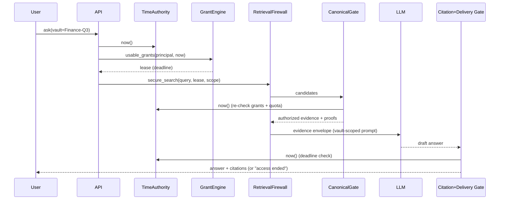
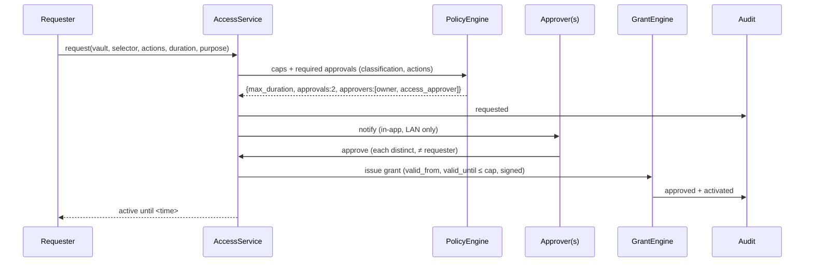
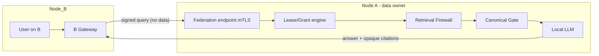

# ARCHITECTURE PACK v3.0 — ADDITIONS (A1–A24)

> This part adds the implementation-level design for **Vaults (scoped RAGs), time-bound grants, delegation, LAN exchange and full-offline operation**. It is additive to §1–§88 below. If anything here conflicts with an older section, **this part wins**. The product-level reasoning lives in the Master Spec, Part V3.

---

## A1. New principles (11–18)

11. **Data is scoped to a vault.** Every record has `vault_id`; every retrieval has `vault_id ∈ scope`.
12. **Everything is a grant.** Role assignment, ownership delegation, share, federation link — all reduce to grants with bounds.
13. **Time is an input from a trusted authority, never from the client.**
14. **Expiry is enforced at use time**, not by schedulers. Schedulers only clean up.
15. **Delegation can only narrow.** Chain validity is checked on every use.
16. **Fail closed** on clock anomaly, missing grant, unknown vault, broken signature, unreachable authority.
17. **Never move data when a question can move instead** (query-in-place before bundles).
18. **Offline is a tested property**, not an intention (egress canary in CI).

---

## A2. Vault & RAG-scope model

```text
Vault
├── vault_id (uuid)             ├── slug / display_name  ← the "RAG name"
├── tenant_id                   ├── owner_principal_id, steward_role_id
├── classification_ceiling      ├── status: draft|active|frozen|archived|shredded
├── scope_mode: strict_single | federated_opt_in
├── discoverable: bool          ├── allow_delegation: bool, max_delegation_depth
├── retention: {keep_until, legal_hold, purge_mode}
├── key_id (vault KEK ref)      ├── origin: native | imported(bundle_id, node_id)
├── import_terms: {valid_until, no_reshare, no_export}   (only for imported)
└── vault_epoch (int)           ← bumps on any vault-level policy change

RagScope  (runtime object, never client-supplied)
├── vault_ids: tuple[uuid]  (effective = selected ∩ granted ∩ active)
├── prompt_profile: {display_name, allow_general_knowledge=false}
├── retrieval_params
└── namespace: "vault:{id}" or "multi:{sorted-ids-hash}"
```

**Effective scope computation**

```python
def effective_scope(selected: set[UUID], lease: Lease) -> tuple[UUID, ...]:
    granted = {g.vault_id for g in lease.grants if "rag_context" in g.actions}
    active  = {v for v in selected & granted if vault_status(v) == "active"}
    if len(active) > 1 and not all(vault_allows_federated(v) for v in active):
        raise ScopeViolation("multi-vault not permitted")
    return tuple(sorted(active))        # empty ⇒ refuse
```

---

## A3. Retrieval Firewall v3 (vault-aware)

**Contract (type-level):** the only public retrieval function is

```python
def secure_search(query: str, lease: AuthorizationLease, scope: RagScope,
                  purpose: Purpose) -> EvidenceSet: ...
```

No `filters=` parameter exists. The filter AST is built from `(lease.grants, scope)` only.

**Compiled Qdrant filter (per vault, OR-ed across vaults in scope):**

```json
{
  "should": [
    { "must": [
        { "key": "vault_id",        "match": { "value": "V-FIN-Q3" } },
        { "key": "classification",  "range": { "lte": 2 } },
        { "key": "acl_selector",    "match": { "any": ["role:analyst", "user:u9", "tag:audit-2026"] } },
        { "key": "min_clearance",   "range": { "lte": 2 } }
      ],
      "must_not": [ { "key": "deny_selector", "match": { "any": ["user:u9", "role:analyst"] } } ]
    }
  ],
  "min_should": { "conditions": [], "min_count": 1 }
}
```

> Per-user time bounds are **not** pushed into Qdrant (too volatile). Qdrant sees only coarse selectors from grants that are active **now**; the canonical gate re-checks time authoritatively (A5). Data-level embargo (`data_valid_until`) may be pushed down because it belongs to the data, not the user.

**Build-gate contract test (must fail the build if violated):**

```text
for every call site of qdrant.search / scroll / recommend / count:
    assert filter contains must[vault_id == X]  OR  should[...] each containing vault_id
    assert filter was produced by PolicyCompiler (taint tag), not constructed ad hoc
```

**Forbidden graphs (extend §11):**

```text
QRY → Qdrant(no vault_id) → filter later
QRY → LLM → "which vault should I search"
CLIENT → scope parameter → Qdrant
```

---

## A4. PostgreSQL schema (blueprint)

```sql
-- Vaults
CREATE TABLE vaults (
  vault_id        uuid PRIMARY KEY,
  tenant_id       uuid NOT NULL,
  slug            text NOT NULL,
  display_name    text NOT NULL,
  owner_id        uuid NOT NULL,
  steward_role_id uuid,
  classification_ceiling smallint NOT NULL,
  status          text NOT NULL CHECK (status IN ('draft','active','frozen','archived','shredded')),
  scope_mode      text NOT NULL DEFAULT 'strict_single',
  discoverable    boolean NOT NULL DEFAULT false,
  allow_delegation boolean NOT NULL DEFAULT false,
  max_delegation_depth smallint NOT NULL DEFAULT 1 CHECK (max_delegation_depth BETWEEN 0 AND 3),
  retention       jsonb NOT NULL DEFAULT '{}',
  key_id          text NOT NULL,
  origin          text NOT NULL DEFAULT 'native',
  import_terms    jsonb,
  vault_epoch     bigint NOT NULL DEFAULT 1,
  created_at      timestamptz NOT NULL,
  UNIQUE (tenant_id, slug)
);

-- Grants (everything is a grant)
CREATE TABLE grants (
  grant_id        uuid PRIMARY KEY,
  vault_id        uuid NOT NULL REFERENCES vaults,
  grantee_type    text NOT NULL CHECK (grantee_type IN ('user','role','group','node')),
  grantee_id      text NOT NULL,
  selector        jsonb NOT NULL,         -- {"all":true} | {"tags":[..]} | {"resources":[..]} | {"max_classification":2,"fields":[..],"row_predicate":".."}
  actions         text[] NOT NULL,        -- rag_context, view, download, export, share, delegate
  valid_from      timestamptz NOT NULL,
  valid_until     timestamptz,            -- NULL allowed only if classification policy permits
  schedule        jsonb,                  -- {"tz":"Asia/Kolkata","windows":[{"days":"Mon-Fri","from":"09:00","to":"18:00"}]}
  quota           jsonb,                  -- {"max_queries":200,"max_evidence":2000,"max_bytes":10485760}
  conditions      jsonb,                  -- {"min_clearance":2,"mfa_age_s":900,"net":"lan-office"}
  purpose         text NOT NULL,
  delegable       boolean NOT NULL DEFAULT false,
  depth           smallint NOT NULL DEFAULT 0,
  parent_grant_id uuid REFERENCES grants,
  on_behalf_of    uuid,
  issuer_id       uuid NOT NULL,
  agreement_id    uuid,
  state           text NOT NULL CHECK (state IN ('approved','active','suspended','expired','revoked')),
  revoked_at      timestamptz, revoked_by uuid, revoke_reason text,
  signature       bytea NOT NULL,         -- Ed25519 over canonical grant bytes (tamper evidence)
  created_at      timestamptz NOT NULL,
  CHECK (valid_until IS NULL OR valid_until > valid_from),
  CHECK (depth = 0 OR parent_grant_id IS NOT NULL)
);
CREATE INDEX ON grants (grantee_type, grantee_id, state);
CREATE INDEX ON grants (vault_id, state, valid_until);
CREATE INDEX ON grants (parent_grant_id);

-- Usage counters (atomic quota)
CREATE TABLE grant_usage (
  grant_id uuid PRIMARY KEY REFERENCES grants,
  queries bigint NOT NULL DEFAULT 0, evidence bigint NOT NULL DEFAULT 0, bytes bigint NOT NULL DEFAULT 0
);

-- Append-only grant history
CREATE TABLE grant_events (
  event_id bigserial PRIMARY KEY, grant_id uuid NOT NULL, kind text NOT NULL,   -- requested|approved|activated|extended|delegated|suspended|expired|revoked|used
  actor_id uuid, detail jsonb, at timestamptz NOT NULL, prev_hash bytea, hash bytea NOT NULL
);

-- JIT requests
CREATE TABLE access_requests (
  request_id uuid PRIMARY KEY, vault_id uuid NOT NULL, requester_id uuid NOT NULL,
  selector jsonb NOT NULL, actions text[] NOT NULL, duration interval NOT NULL,
  purpose text NOT NULL, justification text NOT NULL,
  state text NOT NULL CHECK (state IN ('requested','approved','denied','cancelled','expired')),
  required_approvals smallint NOT NULL DEFAULT 1, created_at timestamptz NOT NULL
);
CREATE TABLE access_request_approvals (
  request_id uuid REFERENCES access_requests, approver_id uuid NOT NULL,
  decision text NOT NULL CHECK (decision IN ('approve','deny')), at timestamptz NOT NULL,
  PRIMARY KEY (request_id, approver_id),
  CHECK (true)  -- requester<>approver enforced in service AND by trigger below
);

-- Role assignment with validity ("role for a time")
CREATE TABLE role_assignments (
  user_id uuid NOT NULL, role_id uuid NOT NULL,
  valid_from timestamptz NOT NULL, valid_until timestamptz,
  granted_by uuid NOT NULL, PRIMARY KEY (user_id, role_id, valid_from)
);

-- Agreements (role-to-role exchange)
CREATE TABLE access_agreements (
  agreement_id uuid PRIMARY KEY, kind text NOT NULL CHECK (kind IN ('lend','swap','delegate','transfer')),
  party_a jsonb NOT NULL, party_b jsonb NOT NULL, terms jsonb NOT NULL,
  approvals jsonb NOT NULL, state text NOT NULL, created_at timestamptz NOT NULL
);

-- Federation
CREATE TABLE federation_nodes (
  node_id uuid PRIMARY KEY, name text NOT NULL, pubkey bytea NOT NULL, cert_fp bytea NOT NULL,
  enrolled_by uuid NOT NULL, enrolled_at timestamptz NOT NULL, state text NOT NULL
);
CREATE TABLE federation_links (
  link_id uuid PRIMARY KEY, node_id uuid NOT NULL REFERENCES federation_nodes,
  direction text NOT NULL CHECK (direction IN ('inbound','outbound')),
  vault_allowlist uuid[] NOT NULL, max_classification smallint NOT NULL,
  role_map jsonb NOT NULL,          -- remote role → local ceiling role
  grant_id uuid NOT NULL REFERENCES grants, state text NOT NULL
);
CREATE TABLE bundles (
  bundle_id uuid PRIMARY KEY, direction text NOT NULL, vault_id uuid, peer_node uuid,
  sequence bigint NOT NULL, nonce bytea NOT NULL UNIQUE, manifest_hash bytea NOT NULL,
  valid_until timestamptz NOT NULL, state text NOT NULL, created_at timestamptz NOT NULL
);

-- Trusted time
CREATE TABLE trusted_time_state (
  id smallint PRIMARY KEY DEFAULT 1 CHECK (id = 1),
  time_floor timestamptz NOT NULL, last_seen timestamptz NOT NULL,
  status text NOT NULL, last_confirmed_by uuid[], hash bytea NOT NULL
);

-- Break-glass
CREATE TABLE breakglass_events (
  id uuid PRIMARY KEY, principal_id uuid NOT NULL, vault_id uuid NOT NULL, grant_id uuid NOT NULL,
  incident_ref text NOT NULL, reason text NOT NULL, reviewed_by uuid, reviewed_at timestamptz,
  review_due timestamptz NOT NULL
);

-- Add vault_id to every data table
ALTER TABLE resources ADD COLUMN vault_id uuid NOT NULL REFERENCES vaults;
ALTER TABLE chunks    ADD COLUMN vault_id uuid NOT NULL REFERENCES vaults;
ALTER TABLE citation_spans ADD COLUMN vault_id uuid NOT NULL REFERENCES vaults;
```

**Row-level security (per-request, transaction-local settings):**

```sql
-- Backend sets, per request, inside the transaction:
--   SET LOCAL app.principal_id = '...';  SET LOCAL app.now = '<TimeAuthority.now()>';
CREATE FUNCTION trusted_now() RETURNS timestamptz LANGUAGE plpgsql STABLE AS $$
DECLARE t timestamptz := current_setting('app.now')::timestamptz;
BEGIN
  IF abs(extract(epoch FROM (t - clock_timestamp()))) > 120 THEN   -- DB cross-check vs host clock
    RAISE EXCEPTION 'CLOCK_MISMATCH';
  END IF;
  RETURN t;
END $$;

CREATE POLICY chunk_vault_rls ON chunks FOR SELECT USING (
  EXISTS (
    SELECT 1 FROM usable_grants(current_setting('app.principal_id')::uuid, trusted_now()) g
    WHERE g.vault_id = chunks.vault_id
      AND 'rag_context' = ANY (g.actions)
      AND grant_selector_matches(g.selector, chunks.*)
  )
);
```

`usable_grants()` = active state ∧ window ∧ schedule ∧ **recursive chain validity** (A8) ∧ quota remaining.

---

## A5. Grant evaluation algorithm

```python
def usable_grants(principal, now, net_ctx) -> list[Grant]:
    subjects = principal.subjects()                      # user:*, role:* (only roles valid at `now`), group:*
    rows = db.fetch("""SELECT * FROM grants
                       WHERE state='active' AND grantee_id = ANY(%s)
                         AND valid_from <= %s AND (valid_until IS NULL OR %s < valid_until)""",
                    subjects, now, now)
    out = []
    for g in rows:
        if not verify_signature(g):            continue           # tamper → ignore + alert
        if not in_schedule(g.schedule, now):   continue
        if not conditions_ok(g.conditions, principal, net_ctx, now): continue
        if quota_exhausted(g):                 continue
        if not chain_valid(g, now):            continue           # D5
        if vault_status(g.vault_id) != "active": continue
        out.append(g)
    return out

def decide(principal, action, resource, now) -> Decision:
    if explicit_deny(principal, resource):       return DENY("EXPLICIT_DENY")
    if principal.clearance < resource.min_clearance: return DENY("CLEARANCE")
    for g in usable_grants(principal, now, net_ctx):
        if g.vault_id == resource.vault_id and action in g.actions and selector_covers(g.selector, resource):
            return ALLOW(grant_id=g.grant_id, deadline=g.valid_until)
    return DENY("NO_GRANT")
```

Quota is consumed atomically at the Fetch Gateway:

```sql
UPDATE grant_usage SET queries = queries + 1
 WHERE grant_id = $1 AND queries < $2      -- $2 = quota.max_queries
RETURNING queries;                          -- 0 rows ⇒ DENY("QUOTA")
```

---

## A6. Authorization Lease & context deadline

```python
@dataclass(frozen=True)
class AuthorizationLease:
    lease_id: UUID
    principal_id: UUID
    grants: tuple[GrantRef, ...]       # only grants usable at issue time
    policy_epoch: int
    vault_epochs: Mapping[UUID,int]
    issued_at: datetime                # TimeAuthority time
    deadline: datetime                 # min(session_exp, earliest grant end, schedule window end, issued_at + LEASE_TTL)
    time_status: Literal["OK","DEGRADED"]
```

Rules:

* `LEASE_TTL` default **5 min** (30 s for restricted vaults).
* Any request after `deadline` → re-issue lease (re-runs A5). A lease can **never** outlive its shortest grant.
* If `time_status != OK`, grants with `valid_until`/`schedule` are excluded (fail closed); permanent baseline grants still work (availability) but are flagged.
* **Delivery gate (L4):** `assert trusted_now() < lease.deadline` and every cited evidence's `proof.grant_deadline > now` before streaming the final answer.



---

## A7. Trusted Time Authority

```python
class TimeAuthority:
    SKEW = timedelta(seconds=30)
    JUMP = timedelta(hours=6)

    def now(self) -> TrustedTime:
        wall = self._sources_consensus()          # RTC + LAN chrony; reject if sources disagree > SKEW
        st = self._state()                        # persisted floor
        if wall < st.time_floor - self.SKEW:
            self._set_status("CLOCK_ROLLBACK"); alert("clock rollback")
            return TrustedTime(max(wall, st.time_floor), status="ROLLBACK")   # never go backwards
        if wall > st.last_seen + self.JUMP:
            self._set_status("CLOCK_JUMP_QUARANTINE")                         # needs two-person confirm
            return TrustedTime(st.last_seen, status="JUMP")
        self._advance_floor(wall)                 # time_floor = max(time_floor, wall), hash-chained
        return TrustedTime(wall, status="OK")
```

Operational notes:

* Sources: hardware RTC; LAN time server (chrony, optional GPS/PTP). Never an Internet NTP pool.
* `time_floor` is persisted in `trusted_time_state` **and** mirrored into the audit hash chain, so a DB restore from an old snapshot is detected (chain head mismatch).
* Time change by an admin = two-person action (SoD-5).
* Optional hardening: TPM monotonic counter / secure RTC; document that root-on-host can still defeat software time.
* All services read time **only** via this component (lint rule: ban `datetime.now()` in authorization code).

---

## A8. Delegation validator & cascade revoke

```python
def validate_delegation(parent: Grant, req: DelegationRequest, now) -> None:
    require(parent.state == "active" and chain_valid(parent, now), "PARENT_INACTIVE")
    require(parent.delegable and "delegate" in parent.actions,                "D2")
    require(parent.depth + 1 <= min(vault.max_delegation_depth, 3),            "D3")
    require(set(req.actions) <= set(parent.actions) - {"delegate_issue"},     "D1_ACTIONS")
    require(selector_subset(req.selector, parent.selector),                    "D1_SELECTOR")
    require(req.valid_until <= parent.valid_until,                             "D1_TIME")
    require(req.quota <= remaining_quota(parent),                              "D1_QUOTA")
    require(req.grantee_id not in ancestors(parent) | {parent.grantee_id},     "D4_CYCLE")
    if vault.classification >= RESTRICTED:
        require(req.grantee_type == "user",                                    "D7")
        require(vault.allow_delegation,                                        "D8")
    require(not (set(req.actions) & ADMIN_ACTIONS),                            "D9")
    require(not sod_conflict(req.grantee_id, vault.vault_id),                  "D10")
```

**Chain validity** (recursive; used by `usable_grants` and RLS):

```sql
WITH RECURSIVE chain AS (
  SELECT grant_id, parent_grant_id, state, valid_from, valid_until, 0 AS d FROM grants WHERE grant_id = $1
  UNION ALL
  SELECT g.grant_id, g.parent_grant_id, g.state, g.valid_from, g.valid_until, c.d + 1
  FROM grants g JOIN chain c ON g.grant_id = c.parent_grant_id WHERE c.d < 4
)
SELECT bool_and(state = 'active' AND valid_from <= $2 AND (valid_until IS NULL OR $2 < valid_until)) FROM chain;
```

`selector_subset` must be **decidable and conservative**: represent selectors as simple sets/ranges (tags, resource IDs, max_classification, field sets). Arbitrary predicates are *not* allowed in delegable grants, because subset checking of free-form logic is not reliably decidable. (Datalog-style caveats in token systems have this exact comparison problem.)

Cascade revoke is implicit (D5) and additionally recorded:

```text
revoke(G1) → mark G1 revoked → emit 'revoked' event for each descendant at next sweep → policy_epoch++ → invalidate caches/leases
```

---

## A9. Access request & approval service



Server-enforced:

* approver set has no overlap with requester; approvers distinct;
* duration ≤ cap for classification (Master V5.2);
* an expired/denied request cannot be "reopened" — a new request is created;
* **notification channel is local** (in-app / LAN mail relay), no SaaS.

---

## A10. Fetch Gateway pipeline

```text
fetch(lease, vault, selector, mode, purpose)
 1  verify lease (signature, deadline < now?)                 ── else re-lease
 2  vault.status == active ∧ vault ∈ lease scope
 3  decide(principal, mode_action, resource, now)  → grant_id
 4  field/row projection from grant.selector
 5  quota decrement (atomic)
 6  mode handler:
      rag_context → return Evidence (to LLM only)
      view        → server-render + watermark + no-store
      download    → stream decrypted blob with watermark; short signed URL (single use, ≤60 s)
      export      → build extract; watermark; hash recorded
 7  audit proof (A18)
```

No other code path reads blobs/chunk text. Storage service accepts reads only from the Fetch Gateway service identity.

---

## A11. LAN federation — Tier 2 (query-in-place)

```text
Enrollment (out-of-band):
  node A admin shows fingerprint/QR; node B admin confirms; each stores peer pubkey + cert fp.
Link:
  A.federation_links(inbound, vault_allowlist, max_classification, role_map, grant_id→ attenuated grant)
Request envelope (B → A, over mTLS):
  { link_id, remote_principal, remote_roles, vault_id, query, purpose, nonce, ts, sig_B }
A verifies:
  mTLS cert fp ∈ federation_nodes ∧ sig_B ∧ ts within SKEW (TimeAuthority) ∧ nonce unseen
  vault_id ∈ link.vault_allowlist ∧ link.state = active ∧ link grant usable now
Principal at A:
  node:B/user:y  with roles = role_map(remote_roles) ∩ link ceiling      (remote claims never exceed the map)
A runs: lease → secure_search → canonical gate → LLM → citation gate
Response: answer + evidence envelopes with opaque citation IDs (resolvable only via A)
```



Properties: revoke the link or grant → next call fails; no data at rest on B; A's audit shows `node:B/user:y`.

---

## A12. Bundle format — Tier 3

```text
bundle.rvault
├── header        {version, bundle_id, sequence, nonce, created_at(TimeAuthority), valid_until, sender_node}
├── manifest      {vault meta, resource list + SHA-256 per object, policy snapshot, classification ceiling,
│                  terms: {no_reshare, no_export, key_lease_hours}, embedded_grant (attenuated)}
├── payload       AEAD(CEK, canonical text + blobs + (optional) vectors)      // XChaCha20-Poly1305 or AES-256-GCM
├── key_wrap      CEK sealed to recipient X25519 public key (sealed box / HPKE)
└── signatures    Ed25519(sender node) over header+manifest+payload hash  [+ sender admin co-signature for restricted]
```

Import procedure:

```text
1 verify signature chain ∧ pinned sender key
2 sequence > last_sequence(sender)  ∧ nonce unseen              (replay)
3 TimeAuthority.now() < valid_until ∧ now ≥ created_at − SKEW
4 decrypt (only recipient node can) → quarantine → malware/parse scan
5 create vault(origin=imported, status=active, read-only, terms copied, valid_until)
6 re-embed locally OR import vectors (prefer re-embed; vectors are sensitive derived data)
7 grants on the imported vault = recipient admin's choice, capped by embedded_grant ceiling
8 schedule: freeze at valid_until, crypto-shred at valid_until + grace
```

Key lease (optional): vault KEK is wrapped by a **lease key** that the home node re-issues every `key_lease_hours` through a signed lease token (LAN or USB). Missing renewal ⇒ KEK unavailable ⇒ vault locks. Revocation notice = signed list entry; recipients check at import and every lease renewal.

Honest limit: a hostile recipient admin with plaintext access can copy it; leasing/expiry/audit/watermark are deterrents, T2 is the real control.

---

## A13. Key hierarchy

```text
Root secret (passphrase/TPM-sealed, offline backup in safe)
 └─ Master KEK
     ├─ Vault KEK[v]            (per vault; rotation; destroyed on shred)
     │    └─ DEK[v, object]     (per object/blob/field-group; AES-256-GCM)
     ├─ Audit signing key       (Ed25519; separate; HSM/TPM if available)
     ├─ Grant signing key       (Ed25519; separate from audit)
     ├─ Federation node key     (Ed25519 + X25519)
     └─ Backup key              (separate; split across two custodians, Shamir if desired)
```

* Crypto-shred a vault = destroy `Vault KEK[v]` (+ all wrapped DEKs become unreadable) **and** delete its Qdrant points; document the vector caveat.
* Keys never leave the host except wrapped for backup/bundles.

---

## A14. Qdrant design for vaults

Default (recommended): **one collection `secure_chunks`, payload partitioning**

```text
payload: vault_id (keyword, index with is_tenant=true), classification, min_clearance,
         acl_selector[], deny_selector[], acl_version, vault_epoch, content_hash, data_valid_until?
```

* `is_tenant` index on `vault_id` keeps a vault's points together and speeds per-vault filtered search. Qdrant's own guidance favours a single collection with a tenant key for most cases and warns that collection-per-tenant does not scale far.
* **Strict tier:** put only a **small number** of top-sensitivity vaults in their **own collection** (e.g., ≤ 10–20) when you need stronger blast-radius isolation or collection-scoped API keys/JWT. Everything else shares the payload-partitioned collection.
* Imported vaults (T3) → own collection (easy deletion on shred).
* Point IDs unique across the collection; include `vault_id` in the ID derivation to avoid collisions.
* API key + TLS even on localhost; Qdrant reachable only from the retrieval service identity.

---

## A15. Fully-offline deployment profile

```yaml
# docker-compose.offline.yml (excerpt)
networks:
  frontend-net: {}                  # gateway only (published :443 on LAN iface)
  backend-net:  { internal: true }  # no external route
  storage-net:  { internal: true }

services:
  gateway:
    networks: [frontend-net, backend-net]
    ports: ["192.168.10.5:443:443"]     # bind to LAN interface, not 0.0.0.0
  api:        { networks: [backend-net, storage-net], read_only: true, cap_drop: [ALL] }
  llm:        { networks: [backend-net], read_only: true, cap_drop: [ALL], volumes: ["models:/models:ro"] }
  ocr_worker: { network_mode: none, read_only: true, cap_drop: [ALL] }       # talks via mounted queue/volume only
  qdrant:     { networks: [storage-net], environment: { QDRANT__SERVICE__API_KEY_FILE: /run/secrets/qdrant_key } }
  postgres:   { networks: [storage-net] }
```

Host firewall (nftables sketch):

```text
table inet filter {
  chain input   { policy drop;  iif lo accept; ct state established,related accept;
                  ip saddr 192.168.10.0/24 tcp dport 443 accept; }
  chain output  { policy drop;  oif lo accept; ct state established,related accept;
                  ip daddr 192.168.10.0/24 accept; }       # LAN only; Internet unreachable
  chain forward { policy drop; }
}
```

Checklist:

* model files verified at start: `sha256(model) == pinned_manifest[model]` else refuse to start;
* UI assets bundled, CSP `connect-src 'self'`;
* no mDNS; DNS = internal or none;
* certificates from internal CA, short-lived, no OCSP/AIA fetching;
* update path = signed offline bundle (A12-style manifest, minisign/Ed25519, monotonic sequence);
* `/metrics`, `/debug` bound to loopback or removed.

---

## A16. Policy DSL v3

```yaml
# vault + grant templates
vault: finance-q3
display_name: "Finance-Q3"
classification_ceiling: confidential
scope_mode: strict_single
discoverable: false
allow_delegation: true
max_delegation_depth: 1
retention: { keep_until: 2029-12-31, purge_mode: crypto_shred }

grant_templates:
  - name: auditor-48h
    grantee: { role: security_auditor }
    selector: { max_classification: 2, fields: ["*"] , exclude_tags: ["hr-bank"] }
    actions: [rag_context, view]
    bounds:
      max_duration: 48h
      schedule: { tz: Asia/Kolkata, windows: [{ days: Mon-Fri, from: "09:00", to: "18:00" }] }
      quota: { max_queries: 200, max_evidence: 2000 }
    approvals: { required: 1, approvers: [vault_owner] }
    delegable: false
    purpose: quarterly_audit

  - name: restricted-readonly-24h
    selector: { max_classification: 3 }
    actions: [rag_context]
    bounds: { max_duration: 24h, max_renewals: 3 }
    approvals: { required: 2, approvers: [vault_owner, access_approver] }
    delegable: false
```

Compiler outputs: grant rows (A4) · RLS predicate inputs · Qdrant selectors (A3) · field projection map · UI capability hints (advisory only).

---

## A17. API contracts (internal architecture)

```text
POST /vaults                               create vault (draft)
POST /vaults/{id}/sources                  add data (upload/import) → quarantine pipeline
POST /vaults/{id}/activate                 owner confirms policy review
GET  /vaults                               only vaults with grant or discoverable=true

POST /access-requests                      {vault_id, selector, actions, duration, purpose, justification}
POST /access-requests/{id}/approve | deny
POST /grants                               direct issue (owner / grant.issue)
POST /grants/{id}/delegate                 attenuate-only (A8)
POST /grants/{id}/extend                   new approval event
POST /grants/{id}/revoke                   cascade
GET  /me/grants                            own active/expiring grants (+ countdown)

POST /rag/{vault_slug}/query               scope fixed by path + lease ∩ grants
POST /breakglass                           {vault_id, incident_ref, reason}

POST /federation/nodes                     enroll (node_admin)
POST /federation/links                     create link + attenuated grant
POST /federation/query                     remote → home (mTLS only, signed envelope)
POST /bundles/export | /bundles/import

GET  /time/status                          OK | DEGRADED | ROLLBACK | JUMP_QUARANTINE (admin)
POST /time/confirm                         two-person confirm after jump
```

Error contract: authorization failures return a uniform shape (`403 ACCESS_DENIED` with a generic message and `request_id`); distinct reasons (`NO_GRANT`, `EXPIRED`, `QUOTA`) are written to audit only, except the user-friendly "your access ended at …" for the user's **own** expired grant.

---

## A18. Authorization proof object v3 (replaces §1.14.3 example)

```json
{
  "evidence_id": "ev_902",
  "principal_id": "u_17",
  "acting_for": null,
  "vault_id": "V-FIN-Q3",
  "resource_id": "res_budget_44",
  "grant_id": "g_101",
  "grant_chain": ["g_101"],
  "grant_deadline": "2026-10-09T18:00:00Z",
  "policy_version": 38, "acl_version": 12, "vault_epoch": 5,
  "decision": "ALLOW",
  "matched_rules": ["GRANT_ACTIVE","SELECTOR_MATCH","CLEARANCE_OK"],
  "time_status": "OK",
  "checked_at": "2026-10-07T12:00:00Z",
  "prev_hash": "…", "hash": "…"
}
```

Audit events are **hash-chained** (each record includes the previous hash); the chain head is mirrored with the time floor (A7).

---

## A19. Cache, share and saved-answer rules (v3)

```text
cache key  = H(vault_scope_ns, principal_id, grant_set_hash, policy_epoch, vault_epochs, normalized_query,
               retriever_version, model_version, prompt_version)
cache TTL  = min(configured, lease.deadline − now)
disabled   = classification ≥ restricted, or any grant with quota/usage bounds
saved answer = {vault_id, evidence_ids[], question, created_by}  (NO answer text copy)
share        = recipient-bound pointer; on open → recipient lease must cover every evidence_id's vault + grant at that moment
```

---

## A20. Fail-closed matrix

| Failure | Behaviour |
|---|---|
| TimeAuthority degraded/rollback | time-bound & scheduled grants excluded; permanent baseline continues; admin alert |
| Grant signature invalid | grant ignored; security alert |
| Unknown / frozen vault | refuse |
| Policy DB unreachable | refuse all data access (no cached allow beyond lease deadline) |
| Qdrant unreachable | refuse (do **not** fall back to unfiltered/lexical-only without RLS) |
| Federation peer unreachable | T2 query fails; no local fallback copy |
| Key lease missed (T3) | vault locks |
| Citation validator error | refuse |
| Audit sink unavailable | refuse high-sensitivity fetches; queue others with bounded buffer |

---

## A21. Test harness additions

```text
Time:        freezegun-style TimeAuthority fake → boundary tests ±1 s; schedule edges; DST/timezone;
             rollback & jump simulations; sweeper disabled
Delegation:  property tests — for random chains, assert child ⊆ parent on every dimension;
             revoke any ancestor ⇒ descendants unusable
Scope:       seed two vaults with near-duplicate chunks; assert zero cross-vault evidence for 10k random queries
Federation:  replay, wrong-cert, tampered envelope, revoked link, out-of-allowlist vault
Bundles:     tamper byte flips, wrong recipient, replay, expired, rollback clock
Offline:     canary container egress must fail; full flow with WAN unplugged
Contract:    static check that every Qdrant call carries a compiler-produced filter with vault_id
```

Critical invariant (extends §18.2):

```text
∀ answer, ∀ citation c: ∃ proof p with p.vault_id ∈ scope ∧ p.grant active at delivery time ∧ p.principal = requester
```

---

## A22. ADRs (new)

* **ADR-008 Vault as the unit of RAG scope.** Rejected: one global RAG with per-user filters only (too easy to widen; weak blast radius). Accepted: `vault_id` mandatory everywhere.
* **ADR-009 Grants as the only permission primitive.** Roles/assignments/shares/links reduce to bounded grants → one engine, one audit shape.
* **ADR-010 Time enforced at use (L1/L3/L4).** Rejected: scheduler-only revocation.
* **ADR-011 Delegation by attenuation with simple selectors.** Rejected: free-form predicates in delegable grants (subset not reliably decidable).
* **ADR-012 Query-in-place preferred over data transfer for LAN sharing.** Bundles only for disconnected sites, with leases.
* **ADR-013 Internal trusted-time authority with persisted floor.** Rejected: raw `now()`.
* **ADR-014 Signed grants (Ed25519) in the DB.** Detect direct-DB tampering; not a substitute for DB access control.
* **ADR-015 Payload-partitioned Qdrant by default; dedicated collections only for top-tier or imported vaults.**

---

## A23. Risk register additions

| Risk | L | I | Control |
|---|---|---|---|
| Approver rubber-stamping | M | H | four-eyes, renewal caps, approval analytics |
| Selector subset bug allows escalation | M | H | simple selectors, property tests |
| Clock tampering | M | H | TimeAuthority, fail closed |
| Imported data copied by hostile admin | M | H | T2 default, leases, no_export, watermark, policy |
| Qdrant filter omitted in new code | M | H | taint-typed filter + build gate |
| Vault name leakage | L | M | discoverability flag, uniform denials |
| Operator mistake (shred wrong vault) | L | H | two-person shred, 24 h grace in archived state |

---

## A24. Research references (added)

* Retrieval-time, passage-level authorization before ranking and at citation time — [Kiteworks](https://www.kiteworks.com/cybersecurity-risk-management/rag-pipeline-security-best-practices/), [WZ-IT](https://wz-it.com/en/knowledge/ki/rag-permissions/), [Sphere](https://www.sphereinc.com/blogs/enterprise-rag-security)
* ReBAC between retrieval and generation — [NHIMG](https://nhimg.org/articles/rebac-is-the-missing-permission-layer-for-enterprise-rag-pipelines/)
* Expiring relationships / time-bound permissions — [AuthZed patterns](https://dev.to/authzd/top-3-most-used-spicedb-caveat-patterns-3gm3), [SpiceDB expiration](https://github.com/authzed/docs/pull/394/files)
* Offline attenuation & delegation tokens — [Biscuit](https://github.com/CleverCloud/biscuit-rust), [CAPMAS](https://arxiv.org/pdf/2609.06500)
* Vector multitenancy & OWASP LLM08 — [OWASP](https://genai.owasp.org/llmrisk/llm082025-vector-and-embedding-weaknesses/), [Qdrant multitenancy](https://qdrant.tech/documentation/examples/multitenancy/), [Qdrant tenant scaling notes](https://www.skills.sh/qdrant/skills/qdrant-multitenancy)
* Offline time integrity — [time-jump patterns](https://www.technetexperts.com/detecting-time-jumps-offline-licenses/amp/)

---

