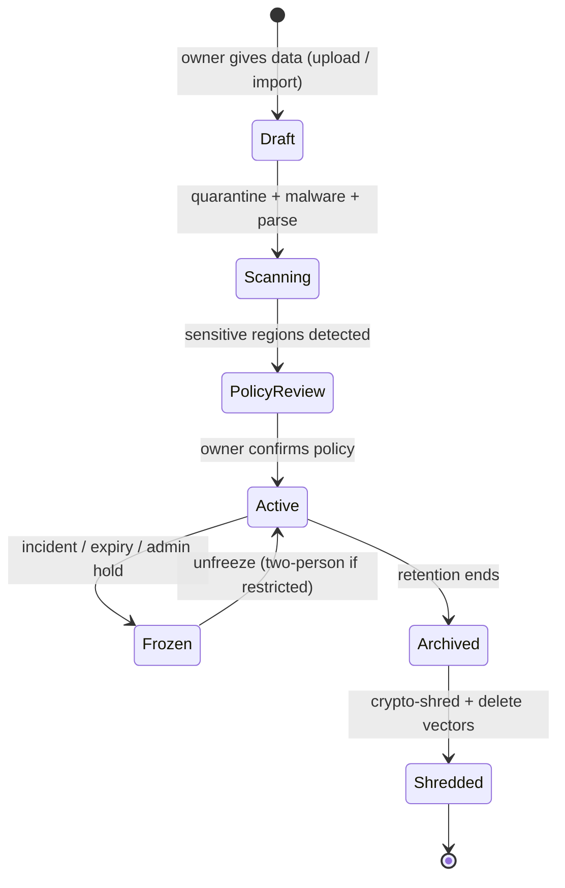
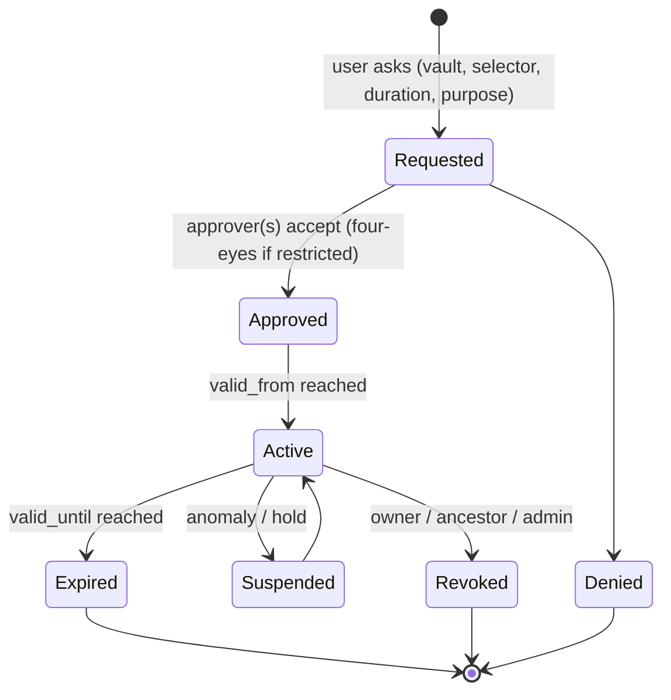

# PART V3 — VAULTS, TIME-BOUND GRANTS, DELEGATION, LAN EXCHANGE, FULL-OFFLINE

> **What changed in v3.0.** v2.0 answered *"may this user see this chunk?"*. v3.0 also answers: **"which dataset is this RAG allowed to know, for how long, who gave that permission, can it be passed on, and can all of this keep working with the network cable unplugged?"**
>
> Everything in this part is **additive**. Sections 1–60 below remain valid; where a v2 rule is tightened, a "v3 note" is placed beside it. If a v2 statement and a Part V3 statement conflict, **Part V3 wins**.

---

## V0. Your requirements → where they are solved

| Requirement | Solved in |
|---|---|
| A role gets permission **for a limited time** to use/fetch data | V5 (time-bound grants), V6 (request/approve), Arch A5–A7 |
| Data is **shared over the LAN** | V8 (three LAN sharing tiers), Arch A11–A13 |
| When someone gives data, **that RAG works only on that data** (the RAG carries the dataset's name) | V2 (Vault = scoped RAG), Arch A2–A3 |
| How data is **fetched** and **kept** for a particular role | V3 (Role Data Home, Fetch Gateway) |
| How permission is **given**, **exchanged** and **delegated** between roles | V6, V7 |
| **Fully offline**, full security | V9 (offline guarantees + trusted time) |
| Research-backed | V16 (sources) |

---

## V1. The v3 mental model — six nouns

```text
VAULT      a named dataset + its own RAG. "Finance-Q3 RAG" knows ONLY the Finance-Q3 vault.
GRANT      a signed, expiring, scoped permission:  who → which vault/selector → which actions → until when.
LEASE      a short-lived (minutes) authorization context derived from the grants that are active RIGHT NOW.
AGREEMENT  a two-sided, approved exchange of permission between roles/owners (lend, swap, delegate, transfer).
NODE       another server on the LAN (own keys, own policy) that may exchange vaults with this one.
CLOCK      a trusted-time service so "until Friday 18:00" still means something with no Internet.
```

```text
 Vault owner ──creates──▶ VAULT ◀──────────── data sources (PDF / image / DB rows)
      │                    │  own key · own Qdrant partition · own RAG name · own audit stream
      │ issues             │
      ▼                    ▼
    GRANT ──(active now?)──▶ LEASE ──▶ Retrieval Firewall ──▶ Canonical Gate ──▶ LLM ──▶ Citation Gate
      │  ▲                         (vault_ids ⊆ granted ∩ requested)
      │  └── delegation (attenuate only)
      ▼
   AGREEMENT / NODE exchange (LAN)  →  imported VAULT on the other side (read-only, expiring)
```

**One rule above all (the "closed-world" rule):**

> A RAG scope can only retrieve from the vaults it was created for **and** the caller currently holds an active grant on. The vault filter is added by the server, never by the client, never by the LLM.

---

## V2. Vault = Scoped RAG ("that RAG works only on that data")

### V2.1 Definition

When a person (or role) **gives data to the system**, the system creates a **Vault** and a **RAG scope** bound to it. The RAG gets the dataset's name (for example `Finance-Q3`, `HR-Policies-2026`, `Project-Alpha`). From that moment:

```text
Ask "Finance-Q3 RAG"   → can use ONLY Finance-Q3 evidence
Ask "HR-Policies RAG"  → can use ONLY HR-Policies evidence
```

### V2.2 Scope rules (S1–S10)

| # | Rule |
|---|---|
| S1 | Every chunk, row, field, OCR region, blob and audit record carries a `vault_id`. No vault-less data exists. |
| S2 | Every query is bound to a `rag_scope = {vault_ids}` chosen by the **server** from (a) what the user selected **and** (b) what the user holds active grants for. Effective scope = selected ∩ granted. |
| S3 | Default scope size is **one vault** (`strict_single`). Multi-vault ("federated query") is opt-in per vault by its owner **and** needs a grant in every vault involved. |
| S4 | Retrieval filters always include `vault_id ∈ effective_scope`. Dropping this clause is a build-gate failure (see Arch A3 contract test). |
| S5 | The LLM is told only: *"You are answering from the vault named X. If the evidence does not contain the answer, say it is not in this vault."* It is never told what other vaults exist. |
| S6 | **Closed-world answers:** no general-knowledge fill-in for facts about the dataset. Refusal text: *"This is not in the Finance-Q3 data."* (Configurable `allow_general_knowledge=false` by default.) |
| S7 | A prompt like *"also check the HR vault"* cannot widen scope — scope is not parsed from natural language. The UI offers a vault selector; the server enforces it. |
| S8 | Citations show the vault name + opaque evidence ID. A citation from vault A can never appear in an answer scoped to vault B (validator rejects it). |
| S9 | Caches, rate-limit buckets, audit streams and saved answers are **namespaced by vault_id**. |
| S10 | Vault *names* can be sensitive. Only principals with `vault.discover` (or an active grant) see a vault in lists; "request access" can be offered only for vaults marked `discoverable`. |

### V2.3 Vault lifecycle



### V2.4 What the user sees

```text
┌ My RAGs ──────────────────────────────────────────────┐
│ ▣ Finance-Q3 RAG        scope: Finance-Q3     ● active │
│    access: Analyst · expires in 2 d 4 h  [request ext.]│
│ ▣ Project-Alpha RAG     scope: Project-Alpha  ● active │
│    access: Member · no expiry                          │
│ ▢ HR-Policies RAG       (not granted)  [request access]│
└────────────────────────────────────────────────────────┘
Answer header:  "Answering from vault: Finance-Q3 · evidence 3 · lease ends 18:00"
```

---

## V3. How data is fetched and kept — per role

### V3.1 Principle: roles don't "own copies"; they hold **access to a vault**

Data is stored **once**, inside its vault, encrypted under that vault's key. A role never receives its own copy. A role receives a **grant**, and every fetch goes through one door.

### V3.2 Role Data Home (who keeps what, where)

| Role | Keeps (owns) | Can fetch (via grant) | Cannot do by default |
|---|---|---|---|
| `vault_owner` | Vaults they created; their policy and grant catalog | Own vault content | Approve their own over-cap extension |
| `vault_steward` (delegated data admin) | Operational control of a vault (ingest, re-index) | Content only if also granted `read` | Change classification ceiling |
| `analyst` | Nothing permanent; saved queries (pointers) | Vaults with active `rag_context`/`view` grants | Download, share, delegate unless the grant says so |
| `uploader` | Items they uploaded **until** accepted into a vault | Own pending uploads | Read other uploads |
| `access_approver` | Approval decisions | No data (decision metadata only) | Approve own request |
| `security_auditor` | Audit/grant records | Source data only through an explicit, time-boxed grant | Edit anything |
| `node_admin` | Federation links, node keys | Bundle metadata | Read vault content |
| `guest` | Nothing | Demo vault only | Everything else |
| `super_admin` | System config | **No automatic data access** | Read vault content without a grant (break-glass only) |

> **v3 note on §4.1:** `super_admin` stays "can administer the machine, cannot silently read the data". Reading requires a grant or a logged break-glass (V5.7).

### V3.3 The single door: **Fetch Gateway**

All data leaves storage through `fetch(authz_lease, vault, selector, mode, purpose)`.

| Mode | What returns | Typical grant |
|---|---|---|
| `rag_context` | Authorized evidence envelope into the local LLM only | most roles |
| `view` | Rendered, watermarked page/row to the browser | analysts |
| `download` | Original file/export | rare, separately granted, never time-bound beyond hours |
| `export` | Structured extract (CSV, etc.) | rarest; always watermarked + audited |
| `share` | Recipient-bound share pointer | needs `share` action and recipient grant |

The gateway applies, in order: **lease valid → vault active → grant chain valid → selector match → field projection → quota decrement → watermark → audit proof**.

### V3.4 Field/row projection per role

The same row yields different projections:

```text
E102  name=Asha  dept=Finance  salary=900000  bank=****1234
analyst (grant: fields=name,dept)     → name, dept
manager (grant: fields=name,dept,salary) → + salary
hr      (grant: fields=*)             → all
```

Denied fields are **removed before the LLM sees the row**, not hidden afterwards.

### V3.5 What "keep" means for derived data

| Derived item | Rule |
|---|---|
| Saved answer | Stored as **pointer + evidence IDs**, not copied text. Re-authorized every time it is opened. If the grant expired, it shows *"access expired"* instead of text. |
| Answer cache | Key includes `vault_id + grant_set_hash + lease_epoch`; entry TTL ≤ nearest grant expiry. Disabled for `restricted` vaults. |
| Export/download | Allowed only with an explicit `download`/`export` action; watermarked with principal + grant + time. These are the **only** copies that can outlive a grant, so they are the rarest grants. |
| Browser memory | Short lease + `Cache-Control: no-store` + view pages rendered server-side; expired lease clears the page. |
| Embeddings | Treated as sensitive; live inside the vault's partition and die with it. |

### V3.6 Retention, hold and destruction

```text
retention_policy per vault: keep_until · legal_hold · purge_mode
purge_mode = crypto_shred   (destroy the vault's data-encryption key → blobs + canonical text unreadable)
           + delete_points  (delete vault's vectors in Qdrant, compact, then disk-level encryption covers remnants)
```

Honest limit: destroying a key makes encrypted blobs/text unreadable, but vectors in Qdrant are not encrypted by that key — they are removed by explicit deletion and protected at rest by full-disk encryption.

---

## V4. Roles v3 and permission vocabulary

### V4.1 New/changed atomic permissions

```text
vault.create        vault.discover      vault.freeze        vault.archive
grant.issue         grant.approve       grant.delegate      grant.revoke        grant.read_own
access.request      access.extend
federation.link     federation.export   federation.import
time.admin          breakglass.invoke   breakglass.review
```

(All v2 permissions in §4.2 remain.)

### V4.2 Separation of duties (hard rules)

| Rule | Meaning |
|---|---|
| SoD-1 | Requester ≠ approver. |
| SoD-2 | Whoever can *issue* a grant for a vault cannot also *audit-edit* its logs (nobody can edit logs). |
| SoD-3 | `security_auditor` cannot hold data grants on the same vault they are auditing **at the same time** unless a second auditor approves. |
| SoD-4 | `node_admin` can link nodes but cannot approve data grants. |
| SoD-5 | Changing system time needs two administrators. |

### V4.3 Role assignments also expire

"A role for a time" is itself a grant: `user_roles(valid_from, valid_until)`. When the role assignment expires, every permission that flowed **only** through that role disappears at the next lease, and no later than the lease TTL.

---

## V5. Time-bound permissions — "permission to use the data for a time"

### V5.1 Five ways to bound a grant

| Type | Example | Field(s) |
|---|---|---|
| **Duration** | 48 hours from approval | `valid_until` |
| **Window** | 2026-10-12 09:00 → 2026-10-14 18:00 | `valid_from`, `valid_until` |
| **Schedule** | Mon–Fri 09:00–18:00 only (local timezone) | `schedule` |
| **Usage** | 200 queries or 50 evidence items or 10 MB | `quota` |
| **Event** | Until audit #A-77 is closed | `until_event` (explicitly closed by approver; hard cap still applies) |

Bounds combine with **AND**: a grant works only inside its window **and** schedule **and** while quota remains.

### V5.2 Recommended maximum durations (tune per organization)

| Classification | Max single grant | Renewal |
|---|---|---|
| public | none | — |
| internal | 90 days | self-extend once |
| confidential | 7 days | approver |
| restricted | 24 hours | approver, max 3 renewals, then new request |
| restricted + `download`/`export` | 1 hour | new approval each time |

### V5.3 Six enforcement layers (expiry must not depend on a cron job)

```text
L1  Context compile   only grants active at trusted-now enter the lease; lease_deadline = min(session, earliest grant end, schedule window end)
L2  Retrieval filter  vault_id + classification + coarse ACL selectors (+ data-level embargo/expiry)
L3  Canonical gate    re-check every grant against trusted-now at evidence-load time  ← authoritative
L4  Delivery gate     before returning an answer, re-check lease_deadline; if passed → refuse or return only still-valid evidence
L5  Expiry sweeper    marks grants expired, bumps policy epoch, kills caches/sessions/shares — housekeeping only
L6  Derived data      saved answers/shares/caches are tied to grants and re-authorized on open
```

> Correctness must hold even if the sweeper is dead for an hour. L1/L3/L4 make that true.

### V5.4 In-flight expiry

If a grant expires **during** generation, the answer is checked at delivery (L4). The user sees: *"Your access to Finance-Q3 ended at 18:00 while this answer was being prepared. Nothing was returned."* No partial leak.

### V5.5 Expiry UX

```text
T-24h / T-1h / T-5m banners ("your Finance-Q3 access ends in 1 h — request extension")
At expiry: RAG tile turns grey; open answers collapse to "access expired"; no error that reveals content
```

### V5.6 Extension, renewal, early revoke

* Extension is a **new approval event** appended to the same grant (history kept), never a silent edit.
* The owner or any ancestor delegator can revoke early; revocation is immediate at the next L1/L3 check (≤ lease TTL, typically ≤ 5 minutes; instant for the canonical gate).

### V5.7 Break-glass (emergency access)

```text
invoke → mandatory reason + incident id → auto-grant ≤ 1 h, read-only, watermarked
       → instant alert to approvers/auditor → post-review within 24 h → unreviewed use escalates
```

Break-glass never bypasses the canonical gate, vault status, or crypto — it only creates a very short, loudly audited grant.

---

## V6. Requesting, approving and giving permission

### V6.1 Just-in-time access request



### V6.2 Who approves what

| Target | Approver |
|---|---|
| public / internal | vault owner or steward |
| confidential | vault owner |
| restricted | vault owner **+** one independent `access_approver` (four-eyes) |
| `download` / `export` | owner + approver, always |
| federation / bundle export | owner + `node_admin` |

### V6.3 Direct grant (owner-initiated)

Owner picks grantee (user/role/group), selector, actions, bounds, purpose → system validates against caps → writes grant → audit proof. No approver needed for ≤ internal if the owner holds `grant.issue`.

### V6.4 Purpose binding

Every grant carries a `purpose` (e.g., `quarterly_audit`, `incident_response`). Usage is logged against it. Purpose is not parsed by the LLM; it is metadata for audit and anomaly alerts (e.g., an `incident_response` grant used for 400 bulk queries).

---

## V7. Exchanging and delegating permission between roles

### V7.1 Delegation invariants (D1–D10)

| # | Invariant |
|---|---|
| D1 | **Attenuate only.** Child grant ⊆ parent: actions ⊆, selector ⊆, fields ⊆, quota ≤ remaining, `valid_until` ≤ parent's. |
| D2 | Delegation requires the parent's `delegable = true`. |
| D3 | `max_depth` (default 1, hard cap 3). A delegate cannot re-delegate unless depth allows. |
| D4 | No cycles (a principal cannot appear twice in one chain). |
| D5 | **Chain validity at use time:** a grant is usable only if **every ancestor** is active. Revoke the parent → all children die with no extra work. |
| D6 | Delegator stays accountable; audit shows the full chain. |
| D7 | `restricted` data can be delegated only to **named users**, never to roles/groups. |
| D8 | Delegating at `confidential+` needs the vault owner's pre-set permission (`allow_delegation = true`). |
| D9 | A delegate can never obtain `grant.issue`, `grant.approve` or `policy.manage` via delegation. |
| D10 | Delegation to a user who is currently a requester/approver conflict (SoD) is rejected. |

### V7.2 Exchange types between roles

| Type | Meaning | Result |
|---|---|---|
| **Lend** | Role/user A temporarily gives B part of what A holds | Child grant, time-boxed |
| **Swap** | A and B give each other access to selected vaults for a period | Two child grants, one agreement |
| **Delegate** | B acts on A's behalf (assistant/deputy) | Child grant with `on_behalf_of` shown in audit |
| **Transfer** | Ownership of a vault moves | Two-person approval; old owner's grants re-issued or revoked |

Every exchange is an **Access Agreement** record: terms, both approvals, resulting grants.

### V7.3 Worked example

```text
Alice (analyst) holds G1: Finance-Q3, read+rag_context, until Fri 18:00, delegable, depth 1.
Alice → lends Bob (intern): G2 = Finance-Q3, rag_context only, until Wed 18:00.   ✅ attenuated
Alice → tries G3 for Carol with download                                            ❌ D1 (action not in parent)
Alice → tries G4 until Sun                                                           ❌ D1 (later than parent)
Bob → tries to re-delegate to Dan                                                    ❌ D3 (depth)
Owner revokes G1 on Tue → Bob's G2 stops working instantly                          ✅ D5
```

---

## V8. Data sharing over the LAN

### V8.1 Three tiers (pick per situation)

| Tier | Name | Data moves? | Revocation | Best for |
|---|---|---|---|---|
| **T1** | Same-server share | No (pointer + grant) | Instant | Colleagues on the same instance |
| **T2** | **LAN federation — query-in-place** (recommended across nodes) | **No**: remote node sends the question; home node answers with cited evidence | Instant (home node decides each call) | Two servers on the same LAN |
| **T3** | Signed encrypted bundle (LAN file transfer or USB) | Yes: imported as a new **read-only, expiring vault** | Expiry + signed revocation + key lease | Truly disconnected sites |

### V8.2 T2 rules (query-in-place)

* Nodes are enrolled **out-of-band** (compare fingerprints in person/QR). No auto-discovery trust.
* Link = mutual TLS with an **internal CA**; link carries an allow-list of vaults and a maximum classification.
* A remote principal becomes `node:B/user:y` and is evaluated against an **attenuated grant** created for that link.
* Home node runs its **own** Retrieval Firewall, Canonical Gate, citation validator. The remote node receives evidence envelopes/answers with opaque citations that resolve **only through the home node**.
* Remote node cannot fetch raw files unless the grant includes `download` (rare).

### V8.3 T3 rules (bundle)

* Bundle = manifest + encrypted payload + sender signature + embedded attenuated grant (`valid_until`, ceiling, `no_reshare`, `no_export`).
* Encrypted to the **recipient node's public key**; replay-protected (nonce + monotonic bundle sequence).
* Imported as a **new vault** (`origin=imported`), whose RAG is named after the dataset and works **only** on it (V2).
* On `valid_until` (+ grace) the imported vault freezes, then **crypto-shreds**. Trusted-time floor stops clock rollback (V9.3).
* Optional **key lease**: bundle key renewed by the home node every N hours; missed renewals lock the vault.

### V8.4 Honest limits

> Once plaintext exists on another machine, the sender cannot technically force deletion from a hostile administrator. T2 avoids this by never moving data. T3 reduces risk with expiry, key lease, `no_export`, watermarking and audit, but is a **policy + deterrent** boundary, not a magic recall button. Say this plainly in the demo.

---

## V9. Fully offline — what must be true

### V9.1 Twelve offline controls

1. Host firewall: **outbound Internet = DROP** (allow LAN → gateway:443 only).
2. Docker backend networks `internal: true`; model/OCR/worker containers `network_mode: none` where possible.
3. All models (LLM, embedding, OCR) loaded from **local, hash-pinned files**; startup refuses on hash mismatch.
4. No CDN assets: fonts, JS, CSS bundled; CSP `default-src 'self'; connect-src 'self'`.
5. No telemetry/update checks; package managers disabled at runtime; dependencies vendored.
6. DNS: internal resolver only (or none); mDNS/Bonjour discovery **off**.
7. Updates and new models arrive as **signed offline bundles** verified with a pinned public key (V9.4).
8. Internal CA issues service and node certificates; no public CA/OCSP calls (use short-lived certs).
9. Time from **local trusted source** (V9.3).
10. Secrets in local encrypted store/TPM-bound; no cloud KMS.
11. Backups to local/LAN encrypted storage only.
12. **Egress canary test** in CI and before demo (V9.5).

### V9.2 What "offline" does *not* remove

LAN attackers, rogue insiders and stolen devices still exist. Offline reduces cloud exposure; Zero-Trust rules (§5) still apply.

### V9.3 Trusted time without Internet

Time-bound permissions are only as good as the clock. Plain `now()` can be abused by rolling the clock back to revive an expired grant.

```text
TimeAuthority (single source for the whole system)
  sources : hardware RTC / LAN time server (chrony; optional GPS/PTP)  → compared, not blindly trusted
  state   : time_floor = highest trusted time ever observed (persisted, hash-chained in audit)
  checks  : now < time_floor − skew      → CLOCK_ROLLBACK  → time-bound grants FAIL CLOSED + alert
            now > last_seen + big_jump   → CLOCK_JUMP      → quarantine: admin (two-person) confirms
  rule    : all grant checks use TimeAuthority.now(), never client time, never JWT iat alone
```

Pattern is the same used by offline licensing/trust systems: persist the greatest trusted time seen, reject rollbacks, allow bounded skew. Honest limit: root on the host can still defeat software clocks; TPM monotonic counters strengthen this but are optional.

### V9.4 Offline update / import ritual

```text
1. Build bundle on a clean machine → sign (Ed25519/minisign) → hash list.
2. Move by USB or LAN share.
3. Target verifies: signature ∧ pinned key ∧ monotonic sequence ∧ validity window ∧ file hashes.
4. Import into quarantine → scan → admin approves → activate.
5. Audit event with bundle hash.
```

### V9.5 Egress canary test

```text
Before demo / on CI:
  - run container with a canary beacon to an external IP/DNS name → must FAIL
  - capture traffic on host: only LAN ↔ gateway:443
  - unplug WAN → run full flow: login → upload → OCR → index → ask → cited answer → grant expiry
```

---

## V10. New threats and mitigations

| Threat | Mitigation |
|---|---|
| Privilege escalation through delegation | D1–D10, depth cap, chain-valid-at-use |
| Delegation loop / confused deputy | cycle check; grants carry issuer and `on_behalf_of`; actions evaluated against the *acting* principal only |
| Clock rollback to revive access | TimeAuthority floor, fail-closed (V9.3) |
| Clock jump forward to expire everyone (DoS) | jump quarantine + two-person confirm |
| Expiry race (grant ends mid-answer) | L3 + L4 gates |
| Stale cached answer after expiry | cache key + TTL ≤ nearest deadline; none for restricted |
| Saved/shared answer outliving access | pointer-only storage; reauthorize on open |
| Vault bleed (query in vault A returns vault B chunk) | `vault_id` in every filter + contract test + validator rejects cross-vault citation |
| Scope widening by prompt ("also check HR vault") | scope never parsed from text |
| Vault name enumeration | `vault.discover`, `discoverable` flag, uniform "request" responses |
| Approval fatigue / rubber-stamping | four-eyes for restricted, approver SLA + anomaly stats, caps on renewals |
| Grant farming (many tiny grants adding up) | per-principal effective-access report + aggregate quota |
| Rogue node on LAN | out-of-band enrollment, mTLS, allow-listed vaults, per-link attenuation |
| Bundle replay / wrong recipient / tamper | nonce, monotonic sequence, recipient-key encryption, signature |
| Break-glass abuse | ≤ 1 h, watermark, instant alert, mandatory review |
| Embedding inversion from stolen vectors | vectors only inside protected network + disk encryption; vault-scoped deletion |

---

## V11. Three end-to-end scenarios

### Scenario 1 — Auditor gets 48 hours

```text
1. Finance owner creates Finance-Q3 vault (confidential).
2. Auditor requests: rag_context + view, 48 h, purpose=quarterly_audit.
3. Owner approves (confidential → owner only). Grant G-101 active.
4. Auditor asks Finance-Q3 RAG → cited answers; every fetch decrements quota.
5. At T+48h: next lease has no G-101; open answers show "access expired".
6. Audit trail: request → approval → each fetch (grant id) → expiry.
```

### Scenario 2 — Delegation attempt blocked

See V7.3. Judges see D1/D3 refusal messages and the audit chain.

### Scenario 3 — LAN sharing with an expiring imported vault

```text
Site A exports bundle "Plant-Safety-Q3" (valid 7 d, no_reshare, no_export) → LAN file copy → Site B imports.
Site B gets "Plant-Safety-Q3 RAG" — works only on that data.
Day 8: imported vault freezes → crypto-shred → RAG tile disappears. Rolling clock back fails (time floor).
```

---

## V12. Data model additions (summary; full SQL in Architecture A4)

```text
vaults · vault_sources · grants · grant_events · grant_usage
access_requests · access_request_approvals · access_agreements
role_assignments (with validity) · federation_nodes · federation_links
bundles · trusted_time_state · breakglass_events
```

Qdrant payload additions: `vault_id` (indexed, `is_tenant`), `vault_epoch`, `data_valid_until` (optional embargo).

---

## V13. New security test matrix

| ID | Test | Expected |
|---|---|---|
| TB-01 | Use grant 1 second before `valid_until` | allowed |
| TB-02 | Use grant 1 second after | denied at L1/L3 |
| TB-03 | Grant expires mid-generation | nothing returned (L4) |
| TB-04 | Stop expiry sweeper; use expired grant | still denied |
| TB-05 | Outside schedule window (Sat) | denied |
| TB-06 | Quota exhausted | denied with generic message |
| TB-07 | Roll system clock back | CLOCK_ROLLBACK, time-bound grants fail closed |
| TB-08 | Jump clock +1 year | quarantine, not mass-expiry without confirm |
| TB-09 | Cached answer after expiry | miss/denied |
| TB-10 | Saved answer after expiry | shows "access expired" |
| DL-01 | Child grant with extra action | rejected (D1) |
| DL-02 | Child grant later than parent | rejected (D1) |
| DL-03 | Re-delegate beyond depth | rejected (D3) |
| DL-04 | Delegation cycle | rejected (D4) |
| DL-05 | Revoke parent, use child | denied (D5) |
| DL-06 | Delegate `restricted` to a role | rejected (D7) |
| DL-07 | Delegate `grant.issue` | rejected (D9) |
| SC-01 | Query vault A; seed matching chunk in vault B | never retrieved |
| SC-02 | Prompt: "also check vault B" | scope unchanged |
| SC-03 | Citation from vault B in vault-A answer | validator rejects |
| SC-04 | Cache shared across vaults | impossible (namespaced) |
| SC-05 | List vaults as user without grant | not shown |
| LN-01 | Remote node queries non-linked vault | denied |
| LN-02 | Revoked link | immediate denial |
| LN-03 | Tampered bundle | import rejected |
| LN-04 | Bundle replay | rejected |
| LN-05 | Bundle for another node | cannot decrypt |
| LN-06 | Imported vault after expiry | frozen → shredded |
| OF-01 | Egress canary | fails (no route) |
| OF-02 | Full flow with WAN unplugged | passes |
| OF-03 | Model file hash mismatch | service refuses to start |
| BG-01 | Break-glass | ≤ 1 h, alert, review task |

---

## V14. Updated demo script (adds ~5 minutes)

1. **Vault creation:** upload Finance-Q3 → "Finance-Q3 RAG" appears; ask a question — works.
2. **Scope proof:** ask it about HR salaries → "not in this vault".
3. **Time-boxed access:** auditor requests 10 minutes (demo duration) → approve → asks → countdown → expiry live → "access expired".
4. **Delegation:** Alice lends Bob; try to escalate; revoke Alice → Bob dies.
5. **LAN:** second laptop as node B → T2 query-in-place; revoke link → instant denial.
6. **Offline:** unplug WAN, show canary failing, repeat flow, try clock rollback.

---

## V15. Build-order additions & what to cut

```text
V-Phase 1  vault_id everywhere + scoped RAG + contract test               (must)
V-Phase 2  grants with valid_until + lease + L1/L3/L4 gates               (must)
V-Phase 3  request/approve workflow + audit proofs with grant_id          (should)
V-Phase 4  delegation D1–D10 + cascade revoke                             (should)
V-Phase 5  TimeAuthority + egress canary                                  (should, cheap)
V-Phase 6  T2 federation (2 nodes, mTLS)                                  (stretch)
V-Phase 7  T3 bundles + key lease + crypto-shred                          (stretch)
```

If time is short: ship V-Phases 1–2 + 5 and **describe** 6–7 honestly as designed-not-built.

---

## V16. Research basis

* **Retrieval-time, document/passage-level authorization is the 2026 baseline** and should happen before ranking and again at citation time, with rights stored on the passage rather than only the document. ([Kiteworks RAG guide](https://www.kiteworks.com/cybersecurity-risk-management/rag-pipeline-security-best-practices/), [WZ-IT: where access control sits](https://wz-it.com/en/knowledge/ki/rag-permissions/), [Sphere](https://www.sphereinc.com/blogs/enterprise-rag-security))
* **Relationship-based (ReBAC) thinking** fits sharing and team-movement better than static roles, and the check should sit between retrieval and generation. ([NHIMG on ReBAC for RAG](https://nhimg.org/articles/rebac-is-the-missing-permission-layer-for-enterprise-rag-pipelines/))
* **Document-level exceptions should stay easy to explain and revoke**; inherit by default, add exceptions for sharing/holds. ([NHIMG FAQ](https://nhimg.org/faq/when-should-organisations-use-document-level-permissions-in-rag/))
* **Expiring relationships are first-class in modern authorization engines** (SpiceDB relationship expiration; earlier caveat patterns for time, IP and session). ([AuthZed caveat patterns](https://dev.to/authzd/top-3-most-used-spicedb-caveat-patterns-3gm3), [SpiceDB expiration docs PR](https://github.com/authzed/docs/pull/394/files))
* **Offline delegation by attenuation** exists in Biscuit/macaroon-style tokens; holder narrows rights without contacting the issuer. OAuth token exchange needs a round trip per hop. ([Biscuit](https://github.com/CleverCloud/biscuit-rust), [CAPMAS paper](https://arxiv.org/pdf/2609.06500))
* **Vector-store multitenancy**: OWASP LLM08 calls for strict logical partitioning and permission-aware stores; Qdrant recommends payload partitioning with a tenant index for most cases and dedicated collections only when isolation/encryption demands it. ([OWASP LLM08](https://genai.owasp.org/llmrisk/llm082025-vector-and-embedding-weaknesses/), [Qdrant multitenancy](https://qdrant.tech/documentation/examples/multitenancy/))
* **Offline time integrity**: persist the greatest trusted time seen, reject rollbacks, tolerate bounded skew. ([offline license time-jump patterns](https://www.technetexperts.com/detecting-time-jumps-offline-licenses/amp/))

**Design judgement (not directly sourced):** the exact caps in V5.2, the D1–D10 list, the three LAN tiers and the key-lease idea are this project's recommendations; tune them to your threat model.

---

